# Architecture

This document explains how Shipshape is built: what runs where, how a request travels through the code, where each rule lives, and why it was built this way. It's written for someone who wants to review the code, change it, or understand it well enough to trust it. You don't need to know Django to follow the diagrams; each section also names the files, so you can open them alongside.

The other documents: the [README](README.md) says how to run the portal and what it does, [DATA-MODEL.md](DATA-MODEL.md) describes every table, and [JUDGING.md](JUDGING.md) explains and defends how judging and voting work.

**How to read it.** Every section starts with a short summary in bold, so you can skim the summaries first and read on where you need detail. The diagrams are written in Mermaid, which GitHub, GitLab and most Markdown previewers draw as pictures; in a plain text editor you'll see their source, which is written to be readable too. Paths are relative to `src/` unless they start with `tests/`.

**Contents**

* [The big picture](#the-big-picture)
* [Why this stack](#why-this-stack)
* [The container: building and starting](#the-container-building-and-starting)
* [Code layout](#code-layout)
* [How a request is handled](#how-a-request-is-handled)
* [Where permission checks live](#where-permission-checks-live)
* [Deadline enforcement](#deadline-enforcement)
* [Sessions and sign-in](#sessions-and-sign-in)
* [The JSON API and CSRF](#the-json-api-and-csrf)
* [Judging](#judging)
* [Community voting](#community-voting)
* [Comments](#comments)
* [Anti-abuse](#anti-abuse)
* [The REST API](#the-rest-api)
* [Webhooks](#webhooks)
* [Certificates and records](#certificates-and-records)
* [Publishing results](#publishing-results)
* [The embeddable gallery](#the-embeddable-gallery)
* [Import and export](#import-and-export)
* [Uploads](#uploads)
* [Security headers](#security-headers)
* [Seeding and demo mode](#seeding-and-demo-mode)
* [Storage](#storage)
* [If this had to host a big public event](#if-this-had-to-host-a-big-public-event)

## The big picture

**In short: one container runs one Django application, with an SQLite database on a Docker volume. People use it in a browser, programs through its APIs, other websites can embed its gallery, and it can notify other systems with webhooks. Nothing in it needs the internet.**

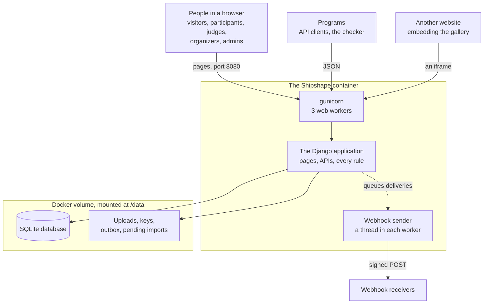
```mermaid
flowchart TB
    people["People in a browser<br/>visitors, participants, judges,<br/>organizers, admins"]
    client["Programs<br/>API clients, the checker"]
    host["Another website<br/>embedding the gallery"]

    subgraph container["The Shipshape container"]
        gunicorn["gunicorn<br/>3 web workers"]
        django["The Django application<br/>pages, APIs, every rule"]
        sender["Webhook sender<br/>a thread in each worker"]
        gunicorn --> django
        django -. "queues deliveries" .-> sender
    end
    subgraph volume["Docker volume, mounted at /data"]
        db[("SQLite database")]
        files["Uploads, keys,<br/>outbox, pending imports"]
    end
    receiver["Webhook receivers"]

    people -- "pages, port 8080" --> gunicorn
    client -- "JSON" --> gunicorn
    host -- "an iframe" --> gunicorn
    django --> db
    django --> files
    sender -- "signed POST" --> receiver
```

| Part | What it does | Where it's set up |
| --- | --- | --- |
| gunicorn | The web server. It runs three worker processes, so three requests can be served at the same moment, and hands each one to Django. | `boot.py` |
| The Django application | Everything else: the pages, the JSON and REST APIs, every rule, and all database access. | `src/` |
| Webhook sender | A background thread in each worker that sends queued webhook deliveries every two seconds. | `webhooks/worker.py` |
| SQLite database | One file, `portal.sqlite3`, in WAL mode. | `portal/settings.py` |
| Uploads, keys, outbox, pending imports | Project images, the secret key, the certificate signing key, emails written to files instead of sent, and uploads waiting for an import to be confirmed. See [Storage](#storage). | `portal/settings.py` |

Pages are rendered on the server. A small script adds countdowns, local-time tooltips and copy buttons, and every page works without it.

## Why this stack

**In short: the brief rewards the boring parts done well, and the portal has to run on a laptop with the network off. Each choice below serves one of those two goals.**

* **Django** ships password hashing, sessions, CSRF protection, forms and migrations. Those are exactly the parts of a submission platform where hand-rolled code goes wrong.
* **SQLite** means one container and no database server to start, wait for or misconfigure. With WAL mode and `BEGIN IMMEDIATE` transactions it handles a hackathon's traffic comfortably, and writes are serialised (one at a time), which makes the deadline and team-size checks easy to reason about: two requests can never both see "one place left" and both take it.
* **Server-rendered templates and hand-written CSS** keep the front end free of dependencies. There's no build step, no JavaScript framework, no CDN and no web font, so nothing can fail to load offline.
* **Five runtime packages**: Django, gunicorn (the web server), whitenoise (static files), Pillow (checking and re-encoding uploaded images) and tzdata (time zones, which a slim image doesn't ship). Django brings two small helpers of its own, asgiref and sqlparse. Nothing else is installed.

## The container: building and starting

**In short: building the image downloads nothing, because everything it needs is in `src/vendor/`. Starting the container updates the database, loads the fixture, and then starts the web server.**

### Building the image, offline

The brief asks for `docker compose up` to bring the portal up with the network off, and on a fresh machine that includes building the image. A normal Python image build downloads a base image from Docker Hub and packages from PyPI; here both are files in the repository, and the build puts them together in four stages.

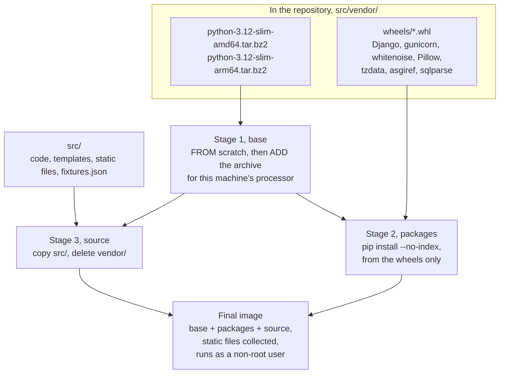
```mermaid
flowchart TB
    subgraph vendor["In the repository, src/vendor/"]
        rootfs["python-3.12-slim-amd64.tar.bz2<br/>python-3.12-slim-arm64.tar.bz2"]
        wheels["wheels/*.whl<br/>Django, gunicorn, whitenoise, Pillow,<br/>tzdata, asgiref, sqlparse"]
    end
    code["src/<br/>code, templates, static files, fixtures.json"]

    base["Stage 1, base<br/>FROM scratch, then ADD the archive<br/>for this machine's processor"]
    packages["Stage 2, packages<br/>pip install --no-index,<br/>from the wheels only"]
    source["Stage 3, source<br/>copy src/, delete vendor/"]
    final["Final image<br/>base + packages + source,<br/>static files collected,<br/>runs as a non-root user"]

    rootfs --> base
    base --> packages
    wheels --> packages
    base --> source
    code --> source
    packages --> final
    source --> final
```

What each stage does, and why:

1. **base** starts `FROM scratch` (an empty image) and `ADD`s `vendor/python-3.12-slim-${TARGETARCH}.tar.bz2`: the root filesystem of the official `python:3.12-slim` image for the machine's processor, amd64 or arm64. This is how the official Debian images are built. The archives are bzip2 because Docker decompresses bzip2 itself; xz would need an `xz` program on the machine running Docker, which isn't always there.
2. **packages** installs the wheels with `pip install --no-index --find-links`, so pip never looks at PyPI, into a separate folder that the final stage copies.
3. **source** copies `src/` and deletes `vendor/`, so the 90 MB of vendored files never reach the image.
4. **The final stage** puts the two together, collects the static files and creates the `shipshape` user the portal runs as.

Three settings make sure nothing slips through. The Dockerfile has no `# syntax=` line, which would make Docker fetch a frontend image. `docker-compose.yml` builds with `network: none`, so a missing file fails the build loudly instead of being downloaded. And it sets `pull_policy: never`, because otherwise the first `up` asks Docker Hub for an image called `shipshape-portal:local` before building it. The whole path was tested in a Docker-in-Docker container with no network and no images: build, boot, the acceptance checker and the test suite all ran, on amd64 and (under emulation) arm64. [src/vendor/README.md](src/vendor/README.md) lists each vendored file with its source, checksum and license.

### Starting up

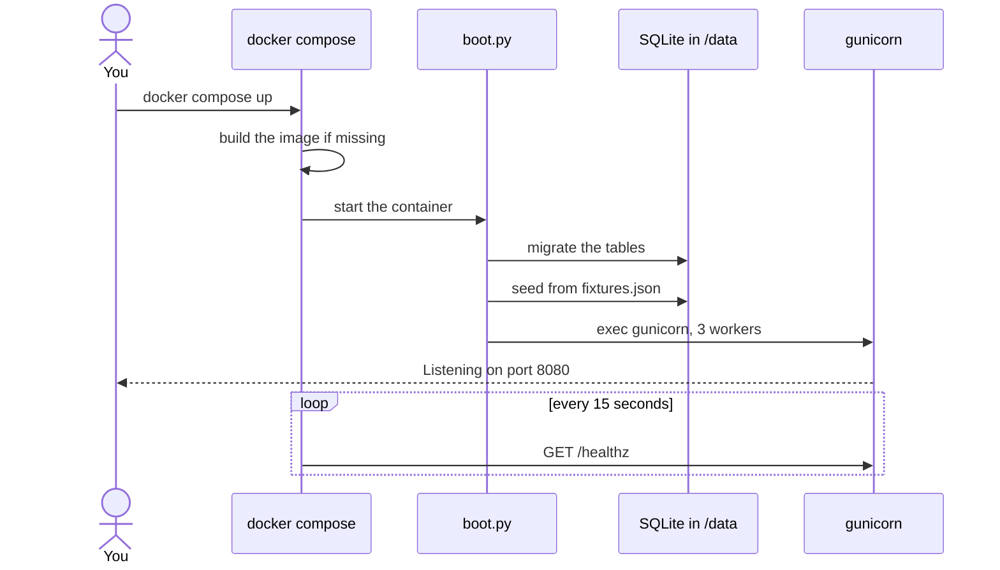
```mermaid
sequenceDiagram
    actor You
    participant Compose as docker compose
    participant Boot as boot.py
    participant DB as SQLite in /data
    participant G as gunicorn
    You->>Compose: docker compose up
    Compose->>Compose: build the image if missing
    Compose->>Boot: start the container
    Boot->>DB: migrate the tables
    Boot->>DB: seed from fixtures.json
    Boot->>G: exec gunicorn, 3 workers
    G-->>You: Listening on port 8080
    loop every 15 seconds
        Compose->>G: GET /healthz
    end
```

* `boot.py` is Python rather than a shell script, so a Windows checkout with CRLF line endings can't break the container.
* It runs `migrate` and then `seed` on every start. The seed matches fixture records by their ids and only creates what's missing, so it's safe to run every time, and edits made in the portal survive restarts ([Seeding and demo mode](#seeding-and-demo-mode)).
* It then replaces itself with gunicorn (`exec`), so Docker's stop signal reaches the web server directly. gunicorn runs with `--no-control-socket`, because gunicorn 26 otherwise tries to write a socket file into the application folder, which the runtime user can't write to.
* `WEBHOOK_WORKER=1` is set only after seeding, so migrating and seeding never start a webhook sender.
* The image's health check fetches `/healthz` every 15 seconds; `docker compose ps` shows the result.

## Code layout

**In short: there's one Django app per area of the brief. In each app, the rules live in a services module and the pages in views, so the web pages and the APIs share one set of rules.**

The application lives in `src/`; the test suite in `tests/`, beside it. The apps build on each other in layers:

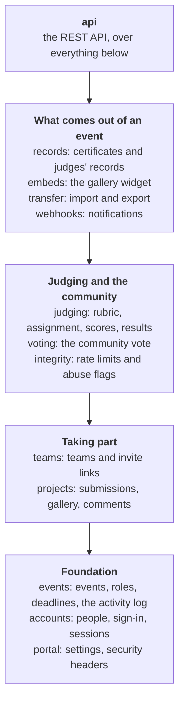
```mermaid
flowchart TB
    api["<b>api</b><br/>the REST API, over everything below"]
    out["<b>What comes out of an event</b><br/>records: certificates and judges' records<br/>embeds: the gallery widget<br/>transfer: import and export<br/>webhooks: notifications"]
    community["<b>Judging and the community</b><br/>judging: rubric, assignment, scores, results<br/>voting: the community vote<br/>integrity: rate limits and abuse flags"]
    taking["<b>Taking part</b><br/>teams: teams and invite links<br/>projects: submissions, gallery, comments"]
    foundation["<b>Foundation</b><br/>events: events, roles, deadlines, the activity log<br/>accounts: people, sign-in, sessions<br/>portal: settings, security headers"]
    api --> out --> community --> taking --> foundation
```

Each box is a layer, and each layer builds on the ones below it: judging uses projects, projects use events, and the API sits on top of all of them. A few imports run the other way, inside functions: the seeder in `events` creates judging and voting rows, and `events.log_activity` hands every log entry to `webhooks`.

| Path | What's in it |
| --- | --- |
| `src/portal/` | Settings, URL root, security headers middleware, error views |
| `src/accounts/` | The user model, sign in and sign up, session tracking, login throttling, the admin page, demo accounts |
| `src/events/` | Events, tracks, prizes, custom questions, event roles, the activity log. Also the three modules everything else leans on: `access.py` (who may do what), `deadline.py` (whether anything may change) and `seeding.py` (loading the fixture) |
| `src/teams/` | Teams and memberships. `services.py` holds every roster rule |
| `src/projects/` | Projects, images, answers, tags. `services.py` saves submissions, `images.py` checks uploads, `api.py` is the JSON API, `views.py` the gallery and forms |
| `src/judging/` | T2. `engine.py` is the pure-Python rubric, assignment and normalization engine (runnable on its own); `access.py` is the isolation layer; `assigning.py`, `scoring.py`, `results.py`, `publishing.py`, `staff.py` and `exports.py` are the services around it; `views.py` is the organizer side, `judge_views.py` the judge side, `api.py` the JSON and CSV endpoints |
| `src/integrity/` | Anti-abuse. `limits.py` is every rate limit in one table plus once-per-burst refusal logging (`Throttle` counts actions that have no table of their own); `detect.py` finds suspicious ballots, duplicate projects and repeated comments; `services.py` is what an organizer can do about them; `views.py` the console's Integrity tab |
| `src/api/` | The REST API. `core.py` is the plumbing (token or session authentication, the endpoint table, errors, paging); `endpoints/` has one module per area; `serializers.py` the JSON shapes; `schema.py` their JSON Schemas, a small validator and form-to-schema conversion; `openapi.py` the OpenAPI 3.1 document; `docs.py` the index and the reference page, all generated from the endpoint table; `models.ApiToken` personal access tokens |
| `src/records/` | Certificates and records. `ed25519.py` signatures (RFC 8032, plain Python); `signing.py` the portal's key and signing; `pdf.py` a small PDF writer; `render.py` the certificate layout; `services.py` awards, issuing, revoking and a judge's receipt; `verify.py` a standalone offline checker |
| `src/transfer/` | Bulk import and export: `export.py` (fixtures.json, shipshape.json and the .zip), `importer.py` (a whole event in), `csvimport.py` (teams and judges from a spreadsheet), `views.py` (Organize, Import an event, and the console's Export and import tab). No models |
| `src/embeds/` | The embeddable gallery: `services.py` (what it shows, where it may be framed, the snippets), `views.py` (the widget page, the loader script, the JSON feed, the console tab). The loader is `static/js/embed.js`; the widget reports its height with `static/js/embed-frame.js` |
| `src/webhooks/` | Webhooks. `delivery.py` queues from the audit log, signs, sends and retries; `worker.py` the background sender; `services.py` managing them; `views.py` the console tab, the admin page and the built-in receiver |
| `src/voting/` | T3 community vote. `method.py` is the pure-Python quadratic and single-vote maths plus the simulation behind the defaults (runnable on its own); `services.py` holds every rule (who a voter is, eligibility, the budget, email links); `results.py` counts; `views.py` has the ballot, its gates and the organizer page; `api.py` the JSON ballot; `exports.py` two CSV stages |
| `src/templates/`, `src/static/` | Markup, one hand-written stylesheet (`static/css/site.css`), and three small scripts: `site.js` (countdowns, local-time tooltips, copy buttons; every page works without it), `embed.js` and `embed-frame.js` (the embeddable gallery) |
| `src/boot.py`, `src/Dockerfile` | Container entrypoint (migrate, seed, exec gunicorn) and the image. `src/` is the Docker build context, so `src/fixtures.json` travels with the code |
| `src/vendor/` | Everything the build would otherwise download: the `python:3.12-slim` root filesystem for amd64 and arm64, and the Python packages as wheels. Third-party files, unmodified; its README has their sources, checksums and licenses |
| `tests/` | 338 tests, grouped by behaviour: deadline, teams, submissions, access, auth, gallery and seed; for judging the engine, isolation, scoring, assignment, invites, exports and the checker's probes; for voting the method, each access mode, eligibility, the window, hidden results, ballot order and the exports; comments and what a team's history may show; for anti-abuse the limits, each detector, the organizer's decisions and the audit filters; for T4 every area of the REST API, the UI-to-API parity check, and webhook queueing, signing, retries, destinations and the receiver; for records the RFC 8032 vectors, the PDF's structure, the award rules, issuing, judge privacy, revocation and the offline verifier; for embedding what the widget shows, where it may be framed, its options, feed and settings; for import and export the fixture and archive round trips, previews, refused files and the spreadsheet rules; and the threat model, one test per attack in JUDGING.md 11, including the open gaps. `tests/attacks/probe.py` is not a test module: it attacks a running portal over HTTP |
| `tests/acceptance/` | The organizers' `run.py` (the acceptance checker) and `spec.md`, unmodified |

## How a request is handled

**In short: every request passes through the same middleware. Then a thin view works out who is asking, a service checks the rules and writes, the activity log records what happened, and the answer goes back with security headers.**

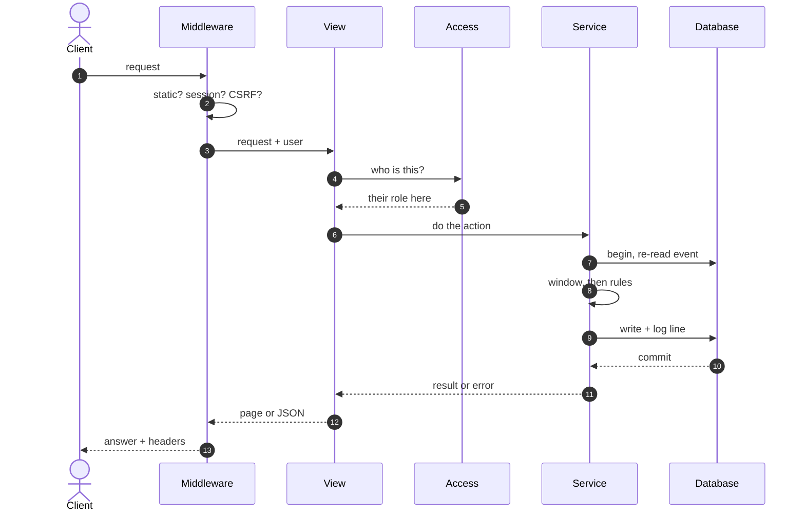
```mermaid
sequenceDiagram
    autonumber
    actor B as Client
    participant M as Middleware
    participant V as View
    participant A as Access
    participant S as Service
    participant D as Database
    B->>M: request
    M->>M: static? session? CSRF?
    M->>V: request + user
    V->>A: who is this?
    A-->>V: their role here
    V->>S: do the action
    S->>D: begin, re-read event
    S->>S: window, then rules
    S->>D: write + log line
    D-->>S: commit
    S-->>V: result or error
    V-->>M: page or JSON
    M-->>B: answer + headers
```

The client is a browser or a program; the view is a page or an API endpoint.

Step by step:

1. **gunicorn** hands the request to Django, which runs it through the middleware in the order below.
2. **The session** is read from the `session` cookie, and `accounts/middleware.py` keeps the list of signed-in browsers up to date. An API request may carry a Bearer token instead (`api/core.authenticate`).
3. **The view** works out who's asking, once: `events/access.Viewer` says whether they're an admin, an organizer, a judge or a participant in this event. Judging views ask `judging/access.py`, which only ever looks at the signed-in judge's own assignments.
4. **A service** does the work (`projects/services.py`, `judging/scoring.py`, `voting/services.py` and so on). A write opens a transaction, re-reads the event row, asks `events/deadline.py` whether the window is open by the server's clock, checks the rules, and writes.
5. **The activity log** gets a line (`events/models.log_activity`). Once the transaction commits, webhooks that listen for it are queued.
6. **The answer** is a rendered page or JSON. A refusal is a message on the page, or `{"error", "detail"}` with its status in the API.

The middleware, in the order a request meets it (`portal/settings.py`):

| Middleware | What it does |
| --- | --- |
| Django's `SecurityMiddleware` | Basic security headers, and HTTPS redirects if they're switched on |
| whitenoise | Serves `/static/` files straight away, from the files collected at build time |
| Sessions | Reads the `session` cookie and loads the session from the database |
| `CommonMiddleware` | URL tidying, such as adding a trailing slash to page addresses |
| CSRF | Checks the hidden token on every HTML form post. The API views are exempt and protect themselves another way ([The JSON API and CSRF](#the-json-api-and-csrf)) |
| Authentication | Turns the session into `request.user` |
| `accounts.SessionActivityMiddleware` | Updates this browser's row in the signed-in sessions list: device and last seen |
| Messages | Carries the one-line notices ("Saved.", "Teams are locked.") to the next page |
| `XFrameOptionsMiddleware` | Refuses to let other sites frame the page |
| `portal.SecurityHeadersMiddleware` | Adds the content security policy and the other headers, unless the view set its own (only the embeddable widget does) |

Views are thin: they load things, ask `access.py`, call a service, and render. The services own the rules, so the web form and the JSON API can't drift apart: both end up in `projects/services.save_submission`, and every score, from the scorecard or the API, goes through `judging/scoring.save_score`.

## Where permission checks live

**In short: two modules decide who may do what, on every request. Templates only choose which buttons to show; they never decide anything, so a hidden button is never the only thing standing in the way.**

The brief's point that "hiding a button is not refusing a request" is the design rule here. This is the one rule for whether someone may see a project, used by the gallery, the home page, both APIs, the embed, images and comments (`events/access.can_view_project`, with `projects/views.listed_projects` for lists):

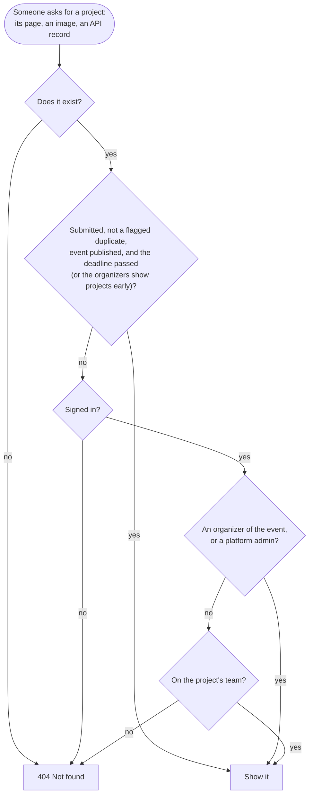
```mermaid
flowchart TD
    start(["Someone asks for a project:<br/>its page, an image, an API record"]) --> exists{"Does it exist?"}
    exists -- no --> nf["404 Not found"]
    exists -- yes --> listed{"Submitted, not a flagged duplicate,<br/>event published, and the deadline passed<br/>(or the organizers show projects early)?"}
    listed -- yes --> show["Show it"]
    listed -- no --> signed{"Signed in?"}
    signed -- no --> nf
    signed -- yes --> staff{"An organizer of the event,<br/>or a platform admin?"}
    staff -- yes --> show
    staff -- no --> team{"On the project's team?"}
    team -- yes --> show
    team -- no --> nf
```

Every "no" ends in the same 404 that a missing id gets, on the pages and the API, so guessing ids reveals nothing about drafts or hidden projects.

Judging data has its own layer, `judging/access.py`:

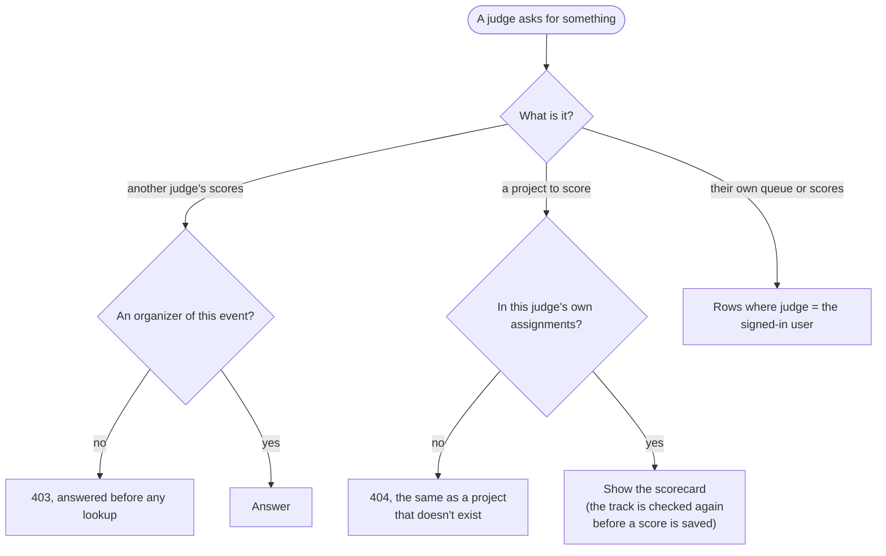
```mermaid
flowchart TD
    q(["A judge asks for something"]) --> kind{"What is it?"}
    kind -- "another judge's scores" --> org{"An organizer of this event?"}
    org -- no --> forbid["403, answered before any lookup"]
    org -- yes --> answer["Answer"]
    kind -- "a project to score" --> assigned{"In this judge's own assignments?"}
    assigned -- no --> nf["404, the same as a project<br/>that doesn't exist"]
    assigned -- yes --> card["Show the scorecard<br/>(the track is checked again<br/>before a score is saved)"]
    kind -- "their own queue or scores" --> own["Rows where judge = the signed-in user"]
```

The rules, in full:

* `events/access.Viewer` works out, once per request, what the current user is in one event: admin, organizer, judge, participant or none of those.
* Every organizer view calls `require_organizer(viewer)`, which raises a 403. The tests post to console URLs as a participant and a judge and check nothing changed.
* Unpublished events, drafts and flagged duplicates return **404** to people who can't see them, so their existence doesn't leak. So do submitted projects before the deadline (unless the organizers show them early).
* Uploaded images go through a view that looks up the owning project and applies the same visibility rule. A draft's screenshot is refused to strangers even if they guess the file name.
* Staff can't compete: organizers, judges and platform admins are refused when they try to start or join a team in the event, and organizers can't add someone who is already on a team as staff.
* Anyone who can see every score can't judge: organizers of the event and platform admins are refused as judges, a judge can't be made an organizer of that event, and a judge can't be promoted to admin while judging.
* Every judge-facing query starts from "rows where judge = the signed-in user"; the assignment table decides whether a judge may open a project at all, and anything outside it is a 404. A request for another judge's scores is a 403, answered before any lookup, so the answer is the same whether that judge exists or not. JUDGING.md, section 5, has the details.

## Deadline enforcement

**In short: one module, `events/deadline.py`, decides whether anything may change. It asks the server's clock, inside the same transaction as the write, so a request can't slip in after the deadline and the browser's countdown is only for show.**

An event moves through three phases, decided by `Event.phase(now)`. The deadline instant itself counts as closed, so "on time" means strictly before it.

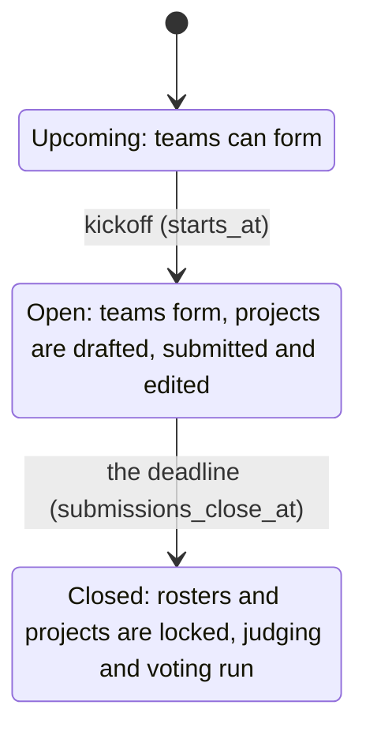
```mermaid
stateDiagram-v2
    state "Upcoming: teams can form" as Upcoming
    state "Open: teams form, projects are drafted, submitted and edited" as Open
    state "Closed: rosters and projects are locked, judging and voting run" as Closed
    [*] --> Upcoming
    Upcoming --> Open : kickoff (starts_at)
    Open --> Closed : the deadline (submissions_close_at)
```

Each kind of change has its own window, all checked in `events/deadline.py`:

| Window | Opens | Closes | What it allows |
| --- | --- | --- | --- |
| Rosters | at any time before the deadline, even before kickoff | the deadline | starting, joining, leaving and renaming a team, a new invite link |
| Projects | kickoff | the deadline | saving, submitting, editing and withdrawing a project, its images |
| Judging | the deadline, so every judge sees final projects | the event's judging end, if it has one; publishing the results also closes it | saving scores |
| Community vote | the vote's opening time, or the deadline if none is set | the vote's closing time, which is required | casting and changing ballots |
| Winners | the event's results date (at once if it has none) | | awards shown publicly |

Every write that touches a project or a roster does the same four things:

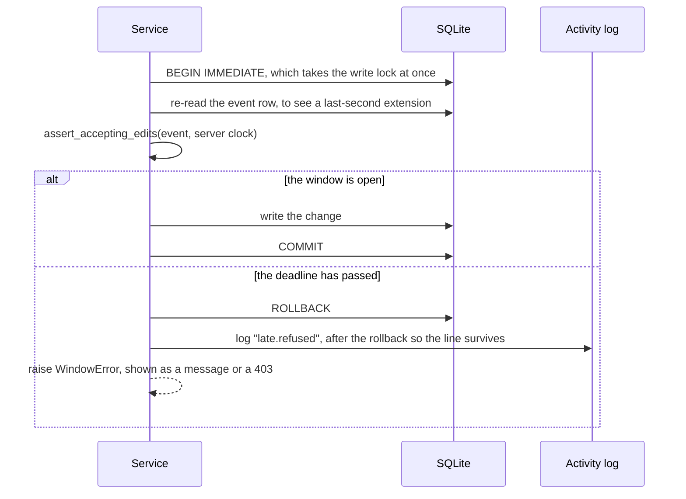
```mermaid
sequenceDiagram
    participant S as Service
    participant D as SQLite
    participant L as Activity log
    S->>D: BEGIN IMMEDIATE, which takes the write lock at once
    S->>D: re-read the event row, to see a last-second extension
    S->>S: assert_accepting_edits(event, server clock)
    alt the window is open
        S->>D: write the change
        S->>D: COMMIT
    else the deadline has passed
        S->>D: ROLLBACK
        S->>L: log "late.refused", after the rollback so the line survives
        S-->>S: raise WindowError, shown as a message or a 403
    end
```

1. Open a transaction. SQLite takes the write lock straight away because of `BEGIN IMMEDIATE`, so no other write can happen between the check and the save.
2. Re-read the event row, so an organizer's last-second extension or cut-off is seen.
3. Call `assert_accepting_edits` or `assert_team_changes_allowed` with the server's clock.
4. Write, and commit.

If the check fails, the transaction rolls back and the refusal is logged afterwards, outside the rolled-back transaction, so the organizer can see who tried what and how late.

The paths that go through this: the submission form (save and submit), withdrawing to draft, the JSON API, image upload and delete, and creating, joining, leaving, renaming and resetting the invite of a team. `tests/test_deadline.py` visits each one after the deadline.

## Sessions and sign-in

**In short: sessions are kept on the server, the cookie can't be read by scripts, and wrong passwords are counted in the database so every web worker agrees.**

* Sessions are stored in the database. The cookie is called `session`, is HttpOnly (page scripts can't read it) and SameSite=Lax (other sites can't send it with their forms), and can be marked Secure with `COOKIE_SECURE=1`.
* `accounts.UserSession` mirrors each session with its device and last-seen time, so the account page can list where you're signed in and end any of them. Changing your password ends every other session; deactivating an account ends all of them.
* Passwords are hashed with Django's PBKDF2 and must be at least ten characters, not common, not all digits and not close to your name or email.
* `accounts/throttle.py` locks an email for fifteen minutes after five wrong passwords, and an IP address after thirty. The counts live in the database so all gunicorn workers agree.
* Signing in rotates the session key (no session fixation) and `next` redirects are checked against the current host (no open redirect).

## The JSON API and CSRF

**In short: the older JSON routes the checker uses sit on the same services as the pages. They can't use a CSRF token, so they protect themselves by accepting only JSON from the portal's own address, and they check the deadline before anything that could hide it.**

`/api/events/<slug>/submission` (GET and POST) and `/api/projects` (GET) sit on the same services as the pages.

The POST endpoint is exempt from Django's CSRF token, because API clients can't fetch a token first. It stays safe from cross-site requests another way: it only accepts `Content-Type: application/json`, which an HTML form on another site can't send without a CORS preflight that this app never answers; it rejects any `Origin` header that isn't this site; and the session cookie is SameSite=Lax. The HTML forms keep Django's normal CSRF tokens.

The order of the checks matters for honesty:

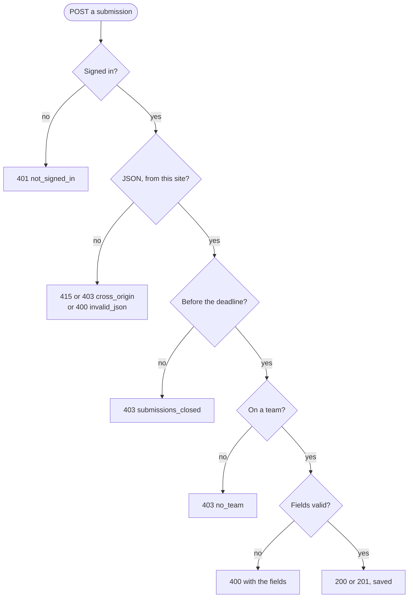
```mermaid
flowchart TD
    req(["POST a submission"]) --> a{"Signed in?"}
    a -- no --> e401["401 not_signed_in"]
    a -- yes --> b{"JSON, from this site?"}
    b -- no --> e415["415 or 403 cross_origin<br/>or 400 invalid_json"]
    b -- yes --> c{"Before the deadline?"}
    c -- no --> e403["403 submissions_closed"]
    c -- yes --> d{"On a team?"}
    d -- no --> e403t["403 no_team"]
    d -- yes --> f{"Fields valid?"}
    f -- no --> e400["400 with the fields"]
    f -- yes --> ok["200 or 201, saved"]
```

A late request is refused as late, whatever else is wrong with it. That's why the acceptance checker's probe gets `403 submissions_closed`, not a CSRF or validation error.

## Judging

**In short: organizers set a rubric and add judges; the engine assigns projects fairly; judges score only what they're given; the ranking is recomputed from the marks on every request, and an organizer publishes it when it's final.**

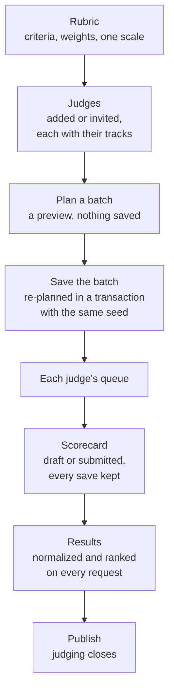
```mermaid
flowchart TB
    rubric["Rubric<br/>criteria, weights, one scale"] --> judges["Judges<br/>added or invited,<br/>each with their tracks"]
    judges --> plan["Plan a batch<br/>a preview, nothing saved"]
    plan --> save["Save the batch<br/>re-planned in a transaction<br/>with the same seed"]
    save --> queue["Each judge's queue"]
    queue --> score["Scorecard<br/>draft or submitted,<br/>every save kept"]
    score --> results["Results<br/>normalized and ranked<br/>on every request"]
    results --> publish["Publish<br/>judging closes"]
```

The judging module follows the same pattern as submissions: the rules live in services, views stay thin, and nothing derived is stored.

* **Engine.** `judging/engine.py` holds the rubric maths, the assignment algorithm and the shrinkage z-score normalization, in plain Python with no Django import, ported from the reference implementation that came with the brief. It can be run on its own (`python src/judging/engine.py --trials 1000`), which is how the normalization proof in JUDGING.md is produced, and it's unit-tested without a database.
* **Assignment.** `assigning.plan_batch` turns the current rows (existing assignments, judges' tracks, conflicts) into engine input and returns a proposal without saving anything. `run_batch` does the same inside a transaction and saves it, with the seed, so a preview and its commit match. Batch and algorithmic mode are the same call with a different scope.
* **Scoring.** `scoring.save_score` re-reads the event, checks the judging window (it opens when submissions close and ends at the event's judging end), passes the assignment gate, re-checks the judge's track, applies the rate limit, validates the marks against the event's scale, writes the score and appends a `ScoreRevision`.
* **Results.** `results.compute_results` builds each judge's raw weighted scores from the marks and the current weights, normalizes them with the event's kappa, and ranks the listed projects, on every request. At a few hundred scores it takes milliseconds, and there's no cache to go stale when a weight changes. `compute_progress` is the same idea for the dashboard, which re-fetches a server-rendered fragment every 10 seconds.
* **Exports.** One builder per stage in `exports.py`, all served from `/api/events/<slug>/export/<stage>.csv` to organizers only, and listed on the console's CSV exports tab.

JUDGING.md explains the methods and the evidence behind them.

## Community voting

**In short: who a voter is depends on the access mode the organizer chose. Whoever they are, the same service checks their eligibility, the voting window and the ballot's budget, and nobody but organizers sees a number until an organizer publishes.**

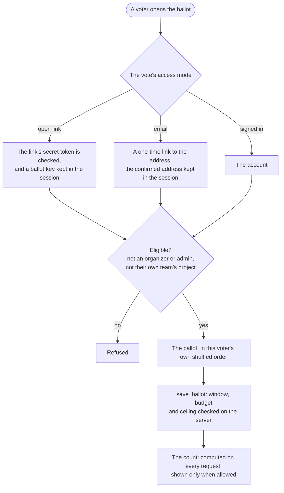
```mermaid
flowchart TD
    v(["A voter opens the ballot"]) --> mode{"The vote's access mode"}
    mode -- "open link" --> link["The link's secret token is checked,<br/>and a ballot key kept in the session"]
    mode -- "email" --> email["A one-time link to the address,<br/>the confirmed address kept in the session"]
    mode -- "signed in" --> acct["The account"]
    link --> elig
    email --> elig
    acct --> elig{"Eligible?<br/>not an organizer or admin,<br/>not their own team's project"}
    elig -- no --> refuse["Refused"]
    elig -- yes --> ballot["The ballot, in this voter's own shuffled order"]
    ballot --> save["save_ballot: window, budget<br/>and ceiling checked on the server"]
    save --> tally["The count: computed on every request,<br/>shown only when allowed"]
```

* **Saving.** `voting/services.save_ballot` opens a transaction, re-reads the event and its voting settings, checks the voting window with the server clock (`events/deadline.assert_voting_open`), checks eligibility, validates the ballot against the method (`voting/method.check`), then replaces the ballot's lines. The ballot page and `/api/events/<slug>/ballot` both go through it.
* **Who a voter is.** `services.voter_for` works it out from the request: the account when voting needs one; a confirmed email address carried in the session (for someone signed in, only their own account's address counts); or, for an open link, the session's own ballot key once the secret token in the address has been checked. Eligibility is checked against every account the voter is known to be, including whoever is signed in, so an organizer can't slip in through an email ballot.
* **Mail.** Email-gated voting needs mail. Settings use SMTP when `EMAIL_HOST` is set and Django's file backend (`DATA_DIR/outbox`) when it isn't, so nothing tries to reach the network by default. Link tokens are stored hashed and used up by a POST, never a GET, because mail scanners open links in advance.
* **Order.** What order a voter sees the projects in is `voting/services.ballot_for`: shuffled with `method.shuffled` from a per-voter seed (an HMAC of the event and the voter's account, confirmed address or open-link session token, keyed with the site's secret), so it's different for every voter and the same for one voter every time. The count and the save don't care about order.
* **The count.** `voting/results.compute_tally` recomputes it from the ballot lines on every request, like the judging results. Who may see it is one function, `voting/services.can_see_results`, which the results page, `/api/events/<slug>/vote/results` and the event page all ask. The CSV exports are organizer-only anyway.

Who may see the count moves through three states:

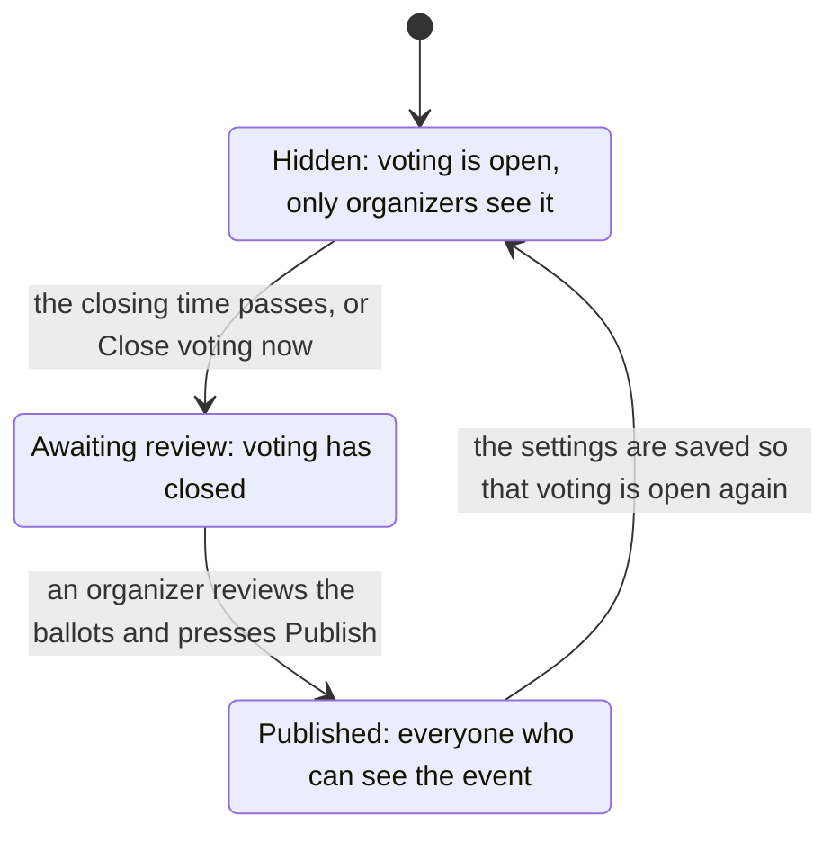
```mermaid
stateDiagram-v2
    state "Hidden: voting is open, only organizers see it" as Hidden
    state "Awaiting review: voting has closed" as Review
    state "Published: everyone who can see the event" as Published
    [*] --> Hidden
    Hidden --> Review : the closing time passes, or Close voting now
    Review --> Published : an organizer reviews the ballots and presses Publish
    Published --> Hidden : the settings are saved so that voting is open again
```

JUDGING.md, section 10, explains the method and the simulation that chose its defaults.

## Comments

**In short: anyone can read the thread under a listed project; signed-in people who aren't judges of the event can write; removal is soft, so an organizer's removal and its reason stay on record.**

`projects/comments.py` holds every rule; the views only call it. A thread exists for listed projects only, writing needs an account and an event with comments switched on, and judges of the event are refused (their opinions are judging data). Removal is soft (`removed_at`, `removed_by`, `removal_reason`), so an organizer's removal is on record and the public thread shows a placeholder. Bodies go through the escape-first Markdown renderer (`events/markdown.py`), which escapes everything first and then adds back a small set of formatting, so a comment can never inject HTML.

Teams see their own history on the team and submission pages. `events/models.team_history` is the only way those pages read it, and it drops judging and voting entries (verbs starting `score.`, `judge.`, `judging.` and `voting.`), which name judges or carry a conflict's reason.

## Anti-abuse

**In short: the portal refuses what is clearly a script and flags what might be cheating, for a person to judge. Every limit lives in one table, and every organizer decision needs a reason and is logged.**

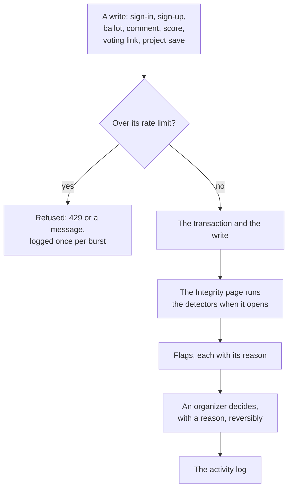
```mermaid
flowchart TB
    act["A write: sign-in, sign-up,<br/>ballot, comment, score,<br/>voting link, project save"] --> limit{"Over its rate limit?"}
    limit -- yes --> refused["Refused: 429 or a message,<br/>logged once per burst"]
    limit -- no --> write["The transaction and the write"]
    write --> page["The Integrity page runs<br/>the detectors when it opens"]
    page --> flags["Flags, each with its reason"]
    flags --> decide["An organizer decides,<br/>with a reason, reversibly"]
    decide --> log["The activity log"]
```

* **Limits.** Every write path checks its limit from `integrity/limits.LIMITS` before its transaction opens (otherwise the refusal's audit line would be rolled back with it). Where the model already records the action (comments, score revisions, email links, ballots), the caller passes that count; otherwise `Throttle` rows are counted. `note_refusal` writes one `rate.limited` activity line per key per window, so a script hammering an endpoint leaves one readable line, not thousands.
* **Detection.** `integrity/detect.py` only flags: bursts of ballots from one network, the same device, copied ballots, email aliases, fresh accounts, duplicate projects, repeated comments, and judges far from their panel.
* **Decisions.** Organizer decisions (`integrity/services.py`) need a reason and are logged: leaving ballots out (`Ballot.excluded_at`, which `voting/results.compute_tally` skips), hiding a duplicate project (`duplicate_of`), removing repeated comments. All of them can be undone.
* **The audit log** is `events.Activity`. Its `event` can be empty for platform-wide entries (sign-in lockouts, sign-up limits, admin account changes), shown at `/admin/audit/`. `events/audit.py` holds the categories and search both log pages use.

## The REST API

**In short: every endpoint is declared once, and that one declaration produces the route, the documentation and the OpenAPI schema. The tests then check that every answer matches its schema and that every page in the portal has an endpoint.**

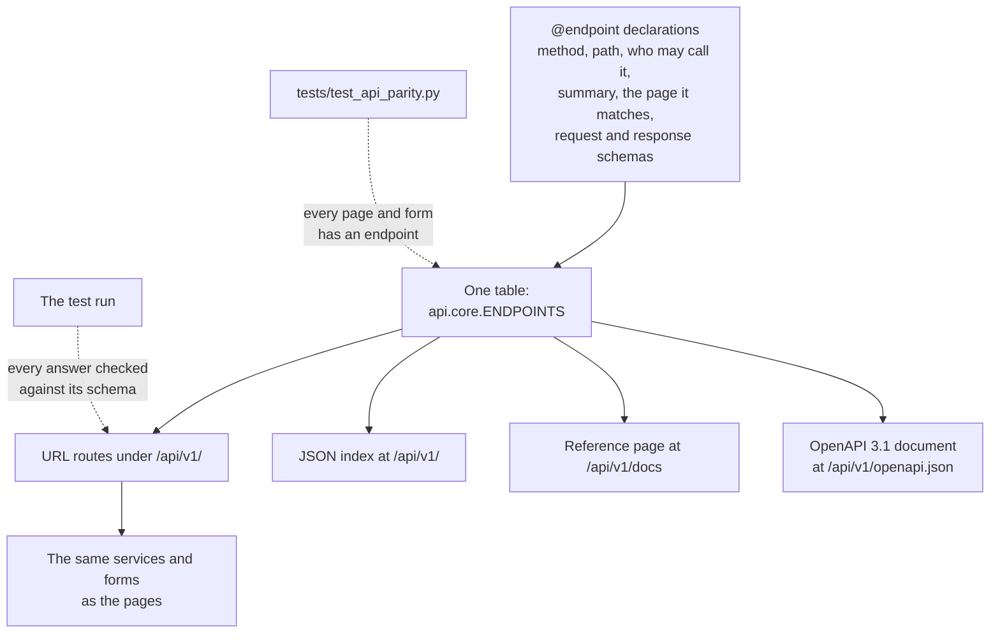
```mermaid
flowchart TB
    decl["@endpoint declarations<br/>method, path, who may call it,<br/>summary, the page it matches,<br/>request and response schemas"] --> table["One table:<br/>api.core.ENDPOINTS"]
    table --> routes["URL routes under /api/v1/"]
    table --> index["JSON index at /api/v1/"]
    table --> docs["Reference page at /api/v1/docs"]
    table --> openapi["OpenAPI 3.1 document<br/>at /api/v1/openapi.json"]
    routes --> services["The same services and forms<br/>as the pages"]
    contract["The test run"] -. "every answer checked<br/>against its schema" .-> routes
    parity["tests/test_api_parity.py"] -. "every page and form<br/>has an endpoint" .-> table
```

Every endpoint is declared once, with `@endpoint(method, path, who=..., summary=..., ui=...)`, into one table (`api/core.ENDPOINTS`). The URL patterns under `/api/v1/`, the JSON index at `/api/v1/` and the HTML reference at `/api/v1/docs` are all built from it, so the documentation can't drift from what's served. `ui` names the page or button the endpoint does the same job as; `tests/test_api_parity.py` maps every route in the site and every form `op` in the templates to endpoints, and fails when one is missing, so a new page can't quietly lack an API.

Endpoints are thin, like the views. They call the same services (`events/services.py`, `accounts/services.py`, `teams/services.py`, `projects/services.py`, `judging/staff.py`, `voting/services.py`, ...) and validate with the same Django forms, fed JSON instead of POST data, so the API can never be more permissive than the pages. A PATCH starts from the form's current values, so a client sends only what changes. Where an older JSON route already existed (the submission, the ballot, scores, progress, results, CSV exports), v1 hands the request to it rather than copying it. Building the API meant moving the logic that was still inline in the console views into services first; the views and the API now share it.

### The OpenAPI document

Each `@endpoint` also declares what it takes and returns: `request=` (the JSON body), `multipart=` (uploads), `query=`, `returns=` and `produces=` (for CSV and zip downloads). They're JSON Schemas written with the helpers in `api/schema.py`, named in a block at the top of each endpoint module, and the shared shapes (one per serializer: Event, Project, Team, Criterion...) are components.

* An endpoint that validates with a Django form declares `request=sc.form_schema(TheForm, ...)`: the schema is built from the form itself (types, required fields, lengths, choices, help text as the description). It's built when the document is built rather than at import, because many forms add fields in `__init__` from the event.
* `api/openapi.py` turns the table into OpenAPI 3.1: paths under `/api` (`/v1/...`, with the older routes beside them, each pointing at its v1 twin), parameters from the URL converters, paging parameters for paged lists, bearer and cookie security, the error responses that apply to each operation (all sharing one Error schema), and a `webhooks` entry for the deliveries.
* It's served at `/api/v1/openapi.json` and written to `src/api/openapi.json` by `manage.py openapi`; a test fails when the committed copy is stale.

The document is checked against the running code, not trusted. The test runner (`portal/testing.Runner`) switches on `api/core._check_contract`: every answer an `/api/v1/` endpoint gives during the tests is validated against its declared schema (errors against Error), with a small validator in `api/schema.py`. Objects refuse keys they don't list, so a field added to a serializer without documenting it fails the tests that return it. `tests/test_openapi.py` drives every endpoint through a realistic event (the older routes are validated there by hand, since they don't pass through `api/core`), and a full run fails if any endpoint was never exercised. Writing the schemas this way found five places where the first draft of the documentation was wrong (deletes return the name of what went, not `true`; the judge's queue says `todo`, not `pending`), which is the point.

Outside the tests: `openapi-spec-validator` accepts the document as OpenAPI 3.1, and Schemathesis (property-based: it generates requests from the document) was pointed at a throwaway container. Its generated GET requests (about 1,000 before the run was stopped by hand) produced no server error. That run didn't finish, so it isn't claimed as a pass of its schema checks.

**Authentication.** `Authorization: Bearer ss_...` is a personal access token: only its SHA-256 is stored, it acts as its owner, and it stops working when revoked, when its owner is deactivated, or when they change their password. The session cookie works too. With the cookie, a POST must be JSON and a foreign `Origin` is refused, like the older routes; PATCH, PUT and DELETE can't be sent cross-site without a preflight; uploads need a token. The services' rule errors come back as `{"error", "detail"}` with their own status, a form's as 400 with `fields`, rate limits as 429. API writes have their own limit on top of each action's.

## Webhooks

**In short: webhooks are fed by the activity log. Once an action's transaction commits, each matching webhook gets a delivery, which a background thread signs, sends and retries.**

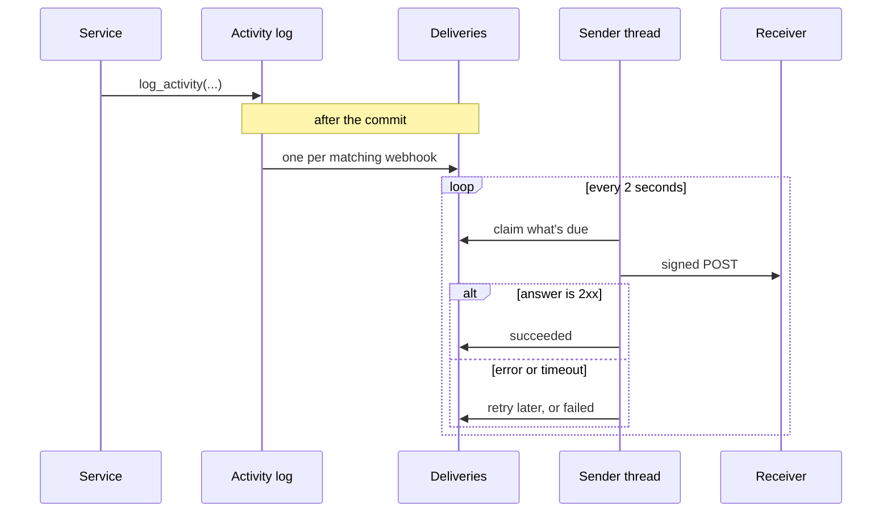
```mermaid
sequenceDiagram
    participant S as Service
    participant L as Activity log
    participant Q as Deliveries
    participant W as Sender thread
    participant R as Receiver
    S->>L: log_activity(...)
    Note over L,Q: after the commit
    L->>Q: one per matching webhook
    loop every 2 seconds
        W->>Q: claim what's due
        W->>R: signed POST
        alt answer is 2xx
            W->>Q: succeeded
        else error or timeout
            W->>Q: retry later, or failed
        end
    end
```

* **What's sent.** `events.models.log_activity` calls `webhooks.delivery.queue_after_commit`, so every entry, once its write commits, becomes a delivery for each active webhook of that event (or, for platform entries, each platform webhook) that listens to its category. A rolled-back action is never announced; a refusal (logged outside any transaction) is. Ballots aren't logged, so votes never leave the portal.
* **Signing.** A delivery is a JSON POST signed with `Shipshape-Signature: t=<time>,v1=<HMAC-SHA256 of "<time>." + body>`, with a unique `Shipshape-Delivery` id, so a receiver can check it came from the portal and drop replays.
* **Sending.** Each web process runs a daemon thread (`webhooks/worker.py`, started when `WEBHOOK_WORKER=1`, which `boot.py` sets) that sends what's due every two seconds. A delivery is claimed with a guarded update, so three gunicorn workers never send one twice.
* **Failing.** Retries follow 1, 5, 30, 120 and 720 minutes, then give up; five given-up deliveries in a row switch the webhook off, logged.
* **Where it may send.** Before sending, the host is resolved, and loopback, link-local (cloud metadata), multicast and unspecified addresses are refused. Private LAN addresses are allowed, since an offline event's receiver is usually there. `WEBHOOK_ALLOW_LOCAL` (on in demo mode) lets deliveries reach the portal's own receiver at `/webhooks/<id>/receive`, which checks signatures exactly as a receiver should.

## Certificates and records

**In short: a certificate or judge's record is a small JSON statement signed with the portal's Ed25519 key. Anyone with the public key can check it later, offline, even when the portal is long gone.**

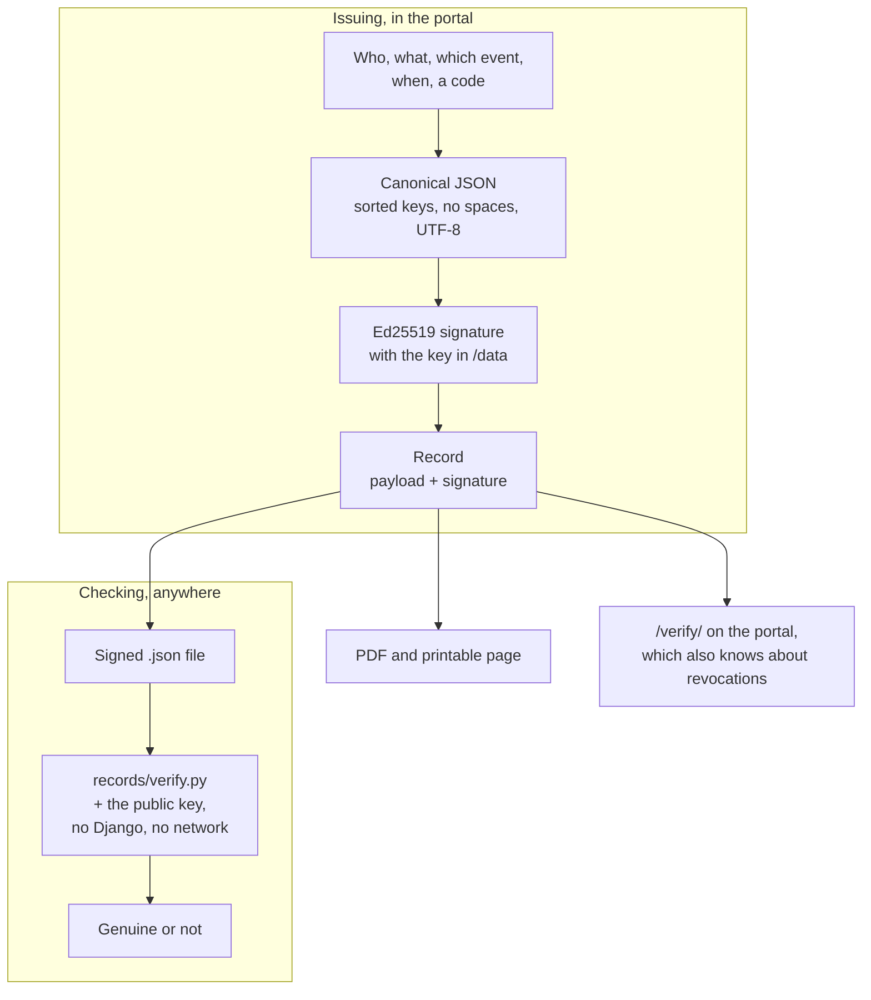
```mermaid
flowchart TB
    subgraph issue["Issuing, in the portal"]
        what["Who, what, which event,<br/>when, a code"] --> canon["Canonical JSON<br/>sorted keys, no spaces, UTF-8"]
        canon --> sign["Ed25519 signature<br/>with the key in /data"]
        sign --> rec["Record<br/>payload + signature"]
    end
    rec --> pdf["PDF and printable page"]
    rec --> file["Signed .json file"]
    rec --> online["/verify/ on the portal,<br/>which also knows about revocations"]
    subgraph check["Checking, anywhere"]
        file --> verify["records/verify.py<br/>+ the public key,<br/>no Django, no network"]
        verify --> answer["Genuine or not"]
    end
```

* **What a record is.** A statement frozen when it's issued: `Record.payload` is the exact JSON that was signed (who, what, which event, when, a code), and `signature` is Ed25519 over that JSON encoded canonically (sorted keys, no spaces, UTF-8).
* **The key.** 32 random bytes made on first use in `DATA_DIR`, or pinned with `RECORD_SIGNING_KEY`. Its public half is on `/verify/`, at `/api/v1/records/key`, in every signed file, on the event page once it has issued records, and at `/.well-known/shipshape-records.json` (readable from any site).
* **Why public-key signatures.** A hackathon's portal usually runs for a weekend, and a certificate that can only be checked by visiting it stops being checkable when the laptop is closed. `records/verify.py` checks a downloaded file with nothing but the standard library.
* **No new packages.** The standard library has no Ed25519 and the stack takes no new packages, so `records/ed25519.py` implements RFC 8032 section 5.1 directly (extended coordinates, a few milliseconds a signature) and the tests hold it to the RFC's published vectors.
* **Certificates** are PDFs made by `records/pdf.py`: one page, the three standard fonts every PDF reader carries (nothing embedded), text measured with the fonts' published widths so it can be centred and wrapped. The HTML page shows the same payload and prints the same way.
* **Judges' records keep scores private.** Judges' scores are private (JUDGING.md, section 5), so a judge's record doesn't list them: it carries a SHA-256 of the judge's submitted scores in a fixed order, and `Record.private` keeps the list it was made from. The receipt page, open only to that judge and the organizers, shows the list, whether it still hashes to the signed value, and whether the judge's scores have changed since.
* **Winners** come from `events.Award` (a prize given to a project), public once the event's results date passes. Issuing is idempotent (issuing again adds nothing); revoking keeps the record, and a check on the portal reports it revoked with the reason.

## Publishing results

**In short: the portal stores only the organizer's decision to publish. The public ranking is computed on each request, and publishing closes judging so the published ranking can't move.**

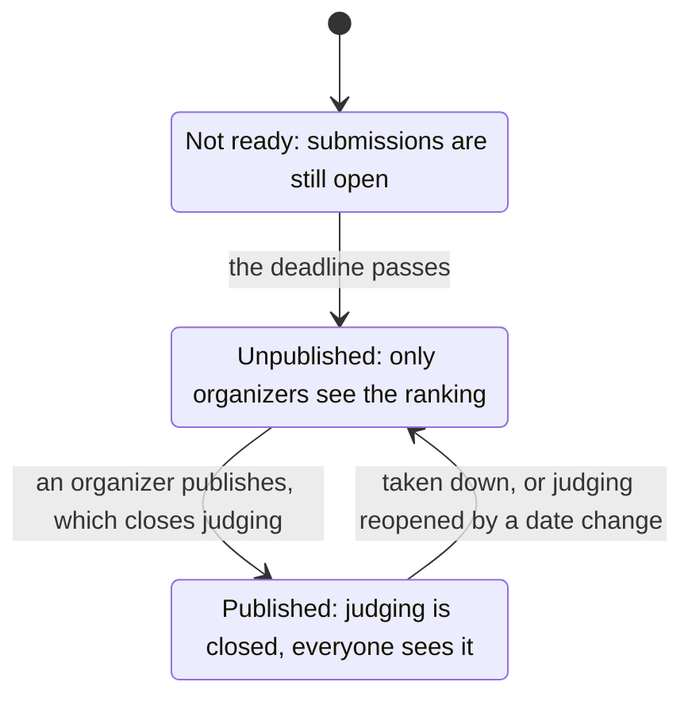
```mermaid
stateDiagram-v2
    state "Not ready: submissions are still open" as NotReady
    state "Unpublished: only organizers see the ranking" as Unpublished
    state "Published: judging is closed, everyone sees it" as Published
    [*] --> NotReady
    NotReady --> Unpublished : the deadline passes
    Unpublished --> Published : an organizer publishes, which closes judging
    Published --> Unpublished : taken down, or judging reopened by a date change
```

`judging/publishing.py` owns it. The only thing stored is the decision (`JudgingConfig.results_published_at`, `results_published_by`, `share_feedback`); the public ranking is computed per request by `results.compute_results`, like the organizers' one.

* `state()` is not_ready (submissions open), unpublished or published, and published also requires judging to be closed, so the rule can't be broken by a date edit: `publish()` closes judging if it's open (logged as a moved date), and `events/services.update_event` takes the results down if judging opens again.
* The results page (`judging.views.public_results`) and `GET /api/v1/events/{slug}/results` both render `publishing.page(viewer, event)`, so they show the same things to the same people:
  * the ranking only when public (or to organizers, as a preview),
  * awards by the existing `records.services.public_awards` rule,
  * the vote by `voting.services.can_see_results`,
  * and to a team member their own place and, when shared, `publishing.feedback()`: averages per criterion and comments in a fixed shuffled order, never a judge's name.

## The embeddable gallery

**In short: the widget is the one page that other sites may frame. It always renders as a signed-out visitor, has nothing to click but links, and the browser itself enforces which sites may show it.**

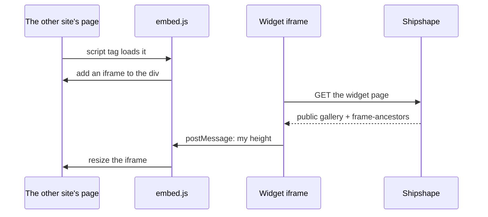
```mermaid
sequenceDiagram
    participant P as The other site's page
    participant L as embed.js
    participant F as Widget iframe
    participant S as Shipshape
    P->>L: script tag loads it
    L->>P: add an iframe to the div
    F->>S: GET the widget page
    S-->>F: public gallery + frame-ancestors
    F->>L: postMessage: my height
    L->>P: resize the iframe
```

* **Framing.** Every page sends `frame-ancestors 'none'` and `X-Frame-Options: DENY`. The widget page (`/embed/events/<slug>/gallery`) is the one exception: it's exempt from X-Frame-Options and sets its own policy with `frame-ancestors 'self'` plus either `*` or the organizer's allowed sites (`embeds.EmbedSettings`), so the browser refuses to show it anywhere else.
* **Why it's safe to frame.** It has no forms and nothing to click but links, which open in a new tab (`<base target="_blank">`), and it always renders as a signed-out visitor (`request.user` is replaced), so a signed-in organizer's drafts can't appear on someone else's page.
* **The loader.** `/embed.js` finds `div[data-shipshape-gallery]` elements, puts a sandboxed iframe in each, and listens for one message type, `shipshape:height`, only from the portal's origin and only from its own frames, to size them. The frame measures its content (not the document, whose height is never less than the frame's) and reports it on load and whenever it changes.
* **The feed.** The JSON feed sends `Access-Control-Allow-Origin: *` and ignores cookies, so it's public data only. Projects come from the gallery's own search (`projects/views.search_projects`) and are shuffled per load by default, for the position-bias reason in JUDGING.md 10.5.

## Import and export

**In short: an export is built from the database on request and never contains secrets. An import always makes a new, unpublished event, and is previewed first by running the whole import and rolling it back.**

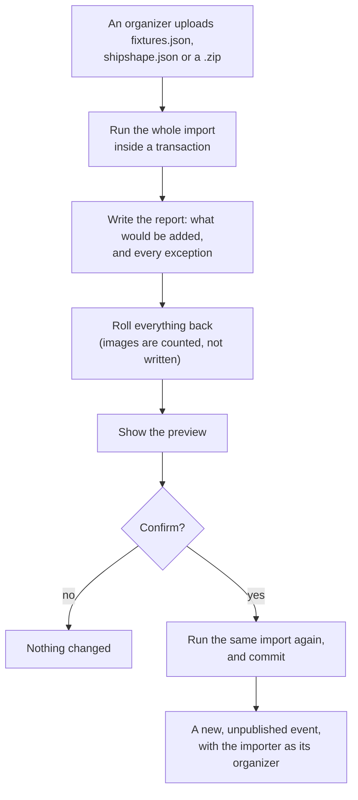
```mermaid
flowchart TD
    up["An organizer uploads fixtures.json,<br/>shipshape.json or a .zip"] --> run1["Run the whole import<br/>inside a transaction"]
    run1 --> report["Write the report: what would be added,<br/>and every exception"]
    report --> rb["Roll everything back<br/>(images are counted, not written)"]
    rb --> preview["Show the preview"]
    preview --> choice{"Confirm?"}
    choice -- no --> nothing["Nothing changed"]
    choice -- yes --> run2["Run the same import again,<br/>and commit"]
    run2 --> newevent["A new, unpublished event,<br/>with the importer as its organizer"]
```

* **Exports.** Built from the database on request; nothing is cached. `export.fixture` writes the DOGFOOD shape (records keep their `external_id`, and ones made here get ids like `prj_<pk>`), so the fixture event exports back to `fixtures.json`. `export.archive` writes `shipshape.json` (format `shipshape-archive`, version 1): every row an organizer can see in the console, people by email, and nothing secret (no password hashes, tokens, webhook secrets or the signing key).
* **Imports.** An import always creates a new, unpublished event, so it can't overwrite one, and the importer becomes its organizer. It runs in one transaction; a preview runs the same code and raises at the end so everything rolls back, which makes the preview report exactly what the real import will do. Images are the one thing a rollback can't undo, so a preview counts them but writes none; the real import re-encodes each through the same Pillow path as an upload.
* **The portal's rules win over the file**, and each exception becomes a line in the report: staff aren't put on teams, a team's second listed project is kept as a flagged duplicate, a project submitted after the deadline arrives as a draft, organizers aren't added as judges. Certificates aren't imported, since they're signed by the old portal's key.
* **Limits.** Uploads are capped (200 MB, 5000 files, 50 MB of JSON) and zip entries whose paths climb out of the archive are ignored.
* **Spreadsheets.** Spreadsheet imports add to a running event through the same checks as adding one person by hand (`assert_team_changes_allowed`, team size, one team per person, `judging.staff.add_judge`); a bad row is skipped and reported and the rest go in. The pending upload waits in `DATA_DIR/imports/` (whole events) or the session (spreadsheets) between the preview and the confirm.

## Uploads

**In short: every uploaded image is opened, checked and redrawn by the server, so the portal only ever serves image files it wrote itself.**

`projects/images.py` handles every upload:

1. Open it with Pillow, and reject anything that isn't a readable JPEG, PNG, WebP or GIF under 5 MB.
2. Cap the pixel count, against decompression bombs (a small file that expands to gigabytes).
3. Fix the orientation and shrink it to at most 1600 px.
4. Write a fresh JPEG, or a PNG when there's real transparency.

Re-encoding strips EXIF data such as phone GPS coordinates and means the server only ever serves bytes it wrote. Files are served with `nosniff` and a sandboxing content security policy, through a view that applies the project's visibility rule.

## Security headers

**In short: every page tells the browser to load nothing from anywhere but the portal itself, which is both a security measure and the offline guarantee: a page couldn't depend on the internet even by mistake.**

Every response carries a content security policy of `default-src 'self'` with no inline scripts or styles, `frame-ancestors 'none'`, `form-action 'self'` and `object-src 'none'`, plus `X-Frame-Options: DENY`, `nosniff`, a same-origin referrer policy and a restrictive permissions policy. Because nothing may load from another origin, a template that accidentally pulled in a CDN script or font would break visibly in development instead of quietly depending on the network. The build is offline too: see [Building the image, offline](#building-the-image-offline).

The CSP is also why track colours and the timeline position are CSS classes rather than inline styles.

## Seeding and demo mode

**In short: every start loads `fixtures.json` into the database, adding only what's missing. With demo mode on, it also adds the demo accounts, a second event and a few things to try.**

`python src/manage.py seed` runs on every boot, from `boot.py`. It matches fixture records by id and only creates what's missing, so edits made in the portal survive restarts. It always loads, from `fixtures.json`:

* the event, its tracks, the judges with their tracks, the teams with their members, and the projects;
* each fixture score as a completed assignment in one "Imported from fixtures.json" batch, against three equal-weight criteria;
* the duplicate `prj_41` as a flagged duplicate of `prj_07`.

With `DEMO_MODE=1` (the default in `docker-compose.yml`) it also creates:

* the organizer, admin and newcomer accounts, and the one-click sign-in buttons;
* the open demo event, Autumn Build Weekend;
* one "Top-up to 3 reviews (demo seed)" batch on the fixture event, which leaves eight reviews pending;
* a community vote on each event, with no ballots;
* one webhook pointed at the portal's own receiver;
* the fixture event's certificates and judges' records;
* the fixed session rows whose cookies the acceptance checker uses (in `.dogfood.toml`).

With demo mode off it removes those session rows again. Every seeded account shares one password hash, so the first boot takes about two seconds instead of a minute.

## Storage

**In short: everything that changes lives in one Docker volume, mounted at `/data`. Nothing secret is baked into the image.**

| In `/data` | What it is |
| --- | --- |
| `portal.sqlite3` (with `-wal` and `-shm` beside it) | The database |
| `media/` | Project images, under `media/projects/<team id>/` |
| `secret_key` | Django's secret key, generated on first boot. It signs sessions and seeds each voter's ballot order |
| `record_signing_key` | The Ed25519 key that signs certificates and records, generated on first use (unless `RECORD_SIGNING_KEY` is set) |
| `outbox/` | Emails written to files when no mail server is set |
| `imports/` | Whole-event uploads waiting between the preview and the confirm |

Backing up an event means copying that volume (`docker compose cp portal:/data ./shipshape-backup`); `docker compose down -v` throws it away, and the next start seeds everything again.

## If this had to host a big public event

**In short: the design fits a hackathon on a laptop. For a large public event, three changes would come first.**

* Put nginx or Caddy in front for TLS and to serve `/media/` and `/static/` directly. That also needs trusted-proxy support added first, so the rate limits don't see every visitor as the proxy's address (JUDGING.md, 11.2).
* Move to Postgres. The code already takes row locks (`select_for_update`) where Postgres would need them; SQLite simply ignores them because its writes are serialised.
* Set `EMAIL_HOST` to a real SMTP server so email-gated voting links are actually delivered, and use it for password resets and judge invites too (both are links to copy today).
