# Data model

This document describes every table Shipshape stores, how the tables relate, how a row changes over its life, the rules the database itself enforces, and exactly how the organizers' `fixtures.json` is loaded. It's for someone reviewing the design, writing a query, or trying to understand what a piece of data means. The [README](README.md) covers running the portal, and [ARCHITECTURE.md](ARCHITECTURE.md) the code around these tables.

**How to read it.** Each area starts with a plain explanation of what its tables are for, then a diagram, then a table of fields. The diagrams are Mermaid entity-relationship diagrams, which GitHub and most Markdown previewers draw as pictures. The line endings say how many rows can be on each side:

| Ending | Means | Example |
| --- | --- | --- |
| `\|\|` | exactly one | every project belongs to exactly one team |
| `o\|` | zero or one | a project has a track, or none yet |
| `o{` | zero or more | a team has any number of projects |
| `\|{` | one or more | |

So `Team ||--o{ Project` reads "one team has zero or more projects, and each project has exactly one team". Every table also has an integer `id`, and every timestamp (`created_at`, `updated_at`, `submitted_at` and so on) is stored in UTC. Code paths are relative to `src/`.

`fixtures.json` (kept at `src/fixtures.json`, where the seeder and the Docker build can reach it) is input, not the schema. This document is the schema, why it looks like this, and how the fixture lands in it.

**Contents**

* [The big picture](#the-big-picture)
* [People and sign-in](#people-and-sign-in)
* [Events](#events)
* [Teams and projects](#teams-and-projects)
* [Judging](#judging)
* [The community vote](#the-community-vote)
* [Certificates, the API, webhooks, embedding and rate limits](#certificates-the-api-webhooks-embedding-and-rate-limits)
* [How rows change over time](#how-rows-change-over-time)
* [One project, followed through the tables](#one-project-followed-through-the-tables)
* [Rules the database enforces on its own](#rules-the-database-enforces-on-its-own)
* [How fixtures.json maps in](#how-fixturesjson-maps-in)
* [The awkward cases, and what we did](#the-awkward-cases-and-what-we-did)

## The big picture

**In short: people take roles in events; teams in an event hand in projects; judges score projects through assignments; the community votes on them with ballots; and everything that happens is written to the activity log.**

These are the main tables and how they connect. Each area below adds the smaller tables around them.

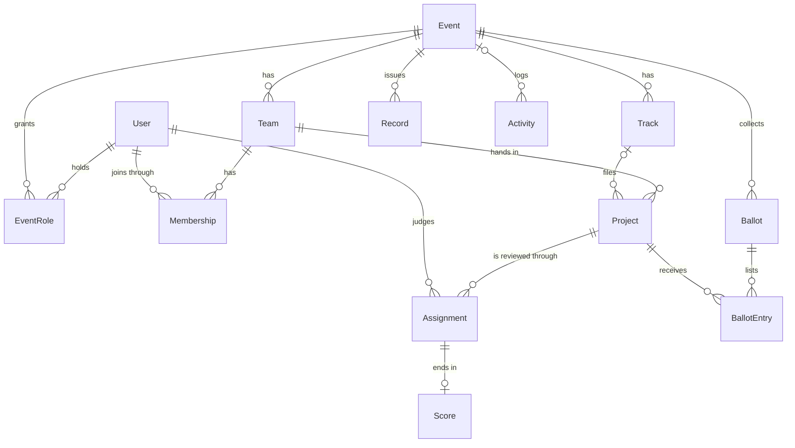

One design choice runs through all of it: **nothing derived is stored**. Weighted totals, z-scores, rankings and the community vote count are computed from the marks and ballot lines on every request. Changing a rubric weight therefore changes every ranking at once, without touching a single score, and there's no cached number that can go stale.

## People and sign-in

**In short: one row per person, with their email as the username, plus a row for each browser they're signed in on and each wrong password they typed.**

A `User` is anyone with an account: participants, judges, organizers and admins alike. What someone may do in a particular event isn't stored on the user; it comes from their `EventRole` rows (see [Events](#events)) and their team memberships. The only role on the user itself is the platform role, which says whether they may create events (`organizer`) or run the whole portal (`admin`).

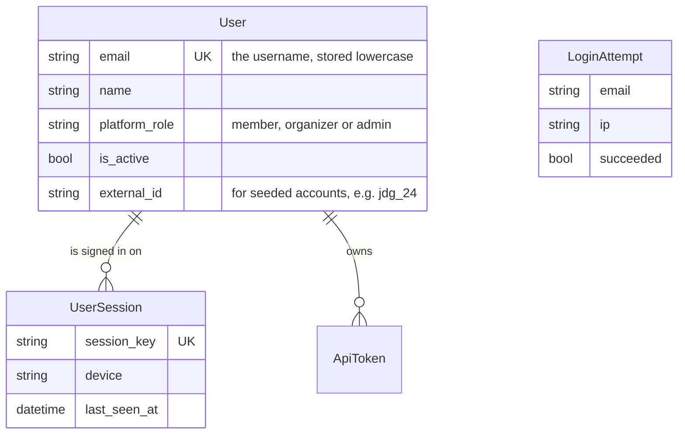

| Model | Key fields | Notes |
| --- | --- | --- |
| `User` | email (unique, stored lowercase), name, platform_role (`member`, `organizer`, `admin`), is_active, external_id | Email is the username. `external_id` records where a seeded account came from, e.g. `jdg_24`. |
| `UserSession` | user, session_key (unique), device, ip, created_at, last_seen_at | One row per signed-in browser, mirroring Django's session table so people can see and end their sessions. |
| `LoginAttempt` | email, ip, succeeded, created_at | Feeds the login throttle. Rows older than a day are deleted. It isn't linked to `User`, because wrong passwords are counted for addresses that may not have an account. |

## Events

**In short: an event holds its dates and settings; tracks, prizes and form questions hang off it; roles say who organizes and who judges; and the activity log records everything that happens in it.**

An event is one hackathon. Its dates decide what's allowed when: kickoff (`starts_at`), the deadline (`submissions_close_at`), the end of judging (`judging_ends_at`) and the date winners become public (`results_at`). Tracks are the categories projects are filed under ("Climate", "Developer tools"), and a judge reviews only their own tracks. `EventRole` is how a person becomes an organizer or a judge of one event, without that power reaching any other event.

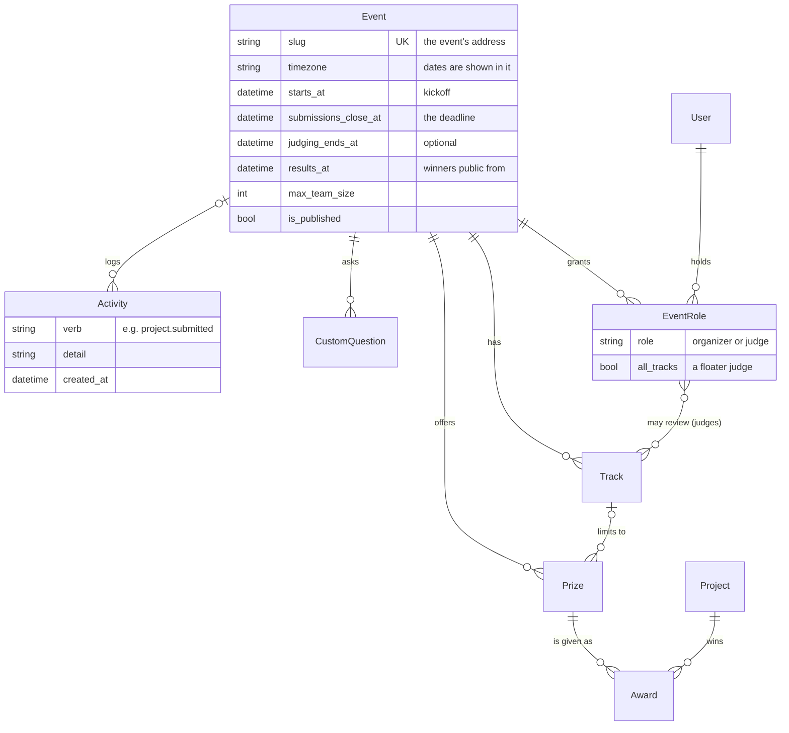

| Model | Key fields | Notes |
| --- | --- | --- |
| `Event` | slug (unique), name, tagline, description, location, timezone, starts_at, submissions_close_at, judging_ends_at, results_at, max_team_size, is_published, comments_enabled, gallery_before_deadline | All datetimes are UTC; `timezone` is only how they're shown. A check constraint keeps the deadline after kickoff. `gallery_before_deadline` (off by default) shows submitted projects publicly before the deadline; off, they wait for it. |
| `EventRole` | event, user, role (`organizer`, `judge`), tracks (M2M), all_tracks | Unique on (event, user, role). A judge's tracks decide what they may review; `all_tracks` makes them a floater who may review any track. |
| `Track` | event, name, description, position | Unique name per event. Its position picks one of eight print colours. |
| `Prize` | event, track (optional), name, value, quantity, position | No track means an overall prize. `value` is free text: "$1,500" or "Mechanical keyboard". |
| `Award` | prize, project, note, awarded_by, created_at | A prize given to a project. Unique per prize and project; no more awards than the prize's quantity; a track prize only to that track. Public once the event's results date has passed (or at once if it has none). |
| `CustomQuestion` | event, prompt, help_text, kind, options, required, is_public, position | Extra questions on the submission form. Kinds: short answer, paragraph, link, pick one, yes or no. Private answers are shown only to the team and organizers. |
| `Activity` | event (empty for platform entries, including account changes: new accounts, password changes, API tokens), actor, verb, detail, team, project, created_at | Append-only log with server timestamps, including refused late edits (`late.refused`), rate-limit refusals (`rate.limited`, once per burst) and organizer anti-abuse decisions. Webhooks are fed from it. |

## Teams and projects

**In short: a team belongs to one event and has members; each team hands in one listed project, with its images, answers to the form questions, tags and comments.**

Teams form through invite links. `Membership` copies the event from its team so that the database itself can refuse a second team for the same person in the same event. A project starts as a draft that only its team and the organizers can see, and becomes public at the deadline once it's submitted. A second project from the same team can exist only as a flagged duplicate, which is how the fixture's `prj_41` is stored.

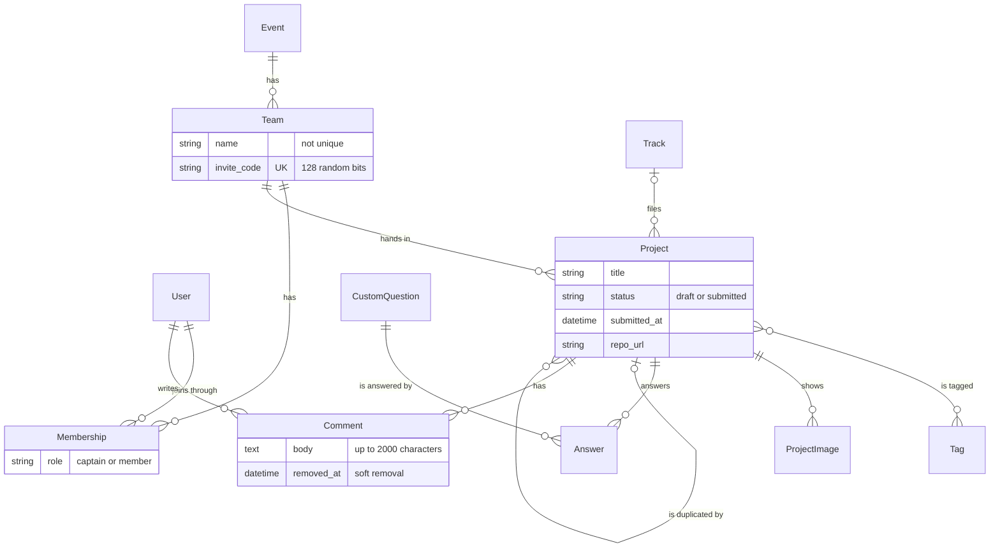

| Model | Key fields | Notes |
| --- | --- | --- |
| `Team` | event, name, invite_code (unique), created_by, external_id | Names are deliberately not unique. The invite code is 128 random bits; the captain can replace it, which kills the old link. |
| `Membership` | team, user, event, role (`captain`, `member`), joined_at | `event` is copied from the team so the database can enforce **one team per person per event** with a unique constraint on (event, user). |
| `Project` | event, team, track, title, tagline, description, thumbnail, demo_video_url, repo_url, live_url, tags, status (`draft`, `submitted`), submitted_at, updated_at, last_edited_by, duplicate_of, external_id | A partial unique constraint on (event, team) where `duplicate_of` is null means **one listed project per team**, while still letting a flagged duplicate exist. |
| `ProjectImage` | project, path, width, height, position | Up to eight per project. Files live under `DATA_DIR/media/projects/<team id>/`. |
| `Answer` | project, question, value | Unique on (project, question). Blank answers are deleted rather than stored. |
| `Tag` | name (unique, lowercase) | Tags are normalised: trimmed, lowercased, inner spaces collapsed, so "Machine  Learning" and "machine learning" are one tag. |
| `Comment` | project, author, body (up to 2000 characters), created_at, removed_at, removed_by, removal_reason | Only listed projects get comments. Removal is soft, so an organizer's removal and its reason stay on record. |

## Judging

**In short: an assignment says "this judge reviews this project"; a score can only exist for an assignment; each score has one mark per criterion; and every save of a score is kept as a revision.**

The event's rubric is its `Criterion` rows, all on one scale set in `JudgingConfig`. The assignment engine runs in batches (`AssignmentBatch`), each of which creates `Assignment` rows and records the random seed it used, so it can be reproduced. The assignment is the gate for everything a judge may see: a judge can open, and score, only projects they have an assignment for. A `Score` is linked one-to-one to its assignment, so a score for an unassigned project can't exist at all. Conflicts of interest are their own rows, and the engine never assigns across one.

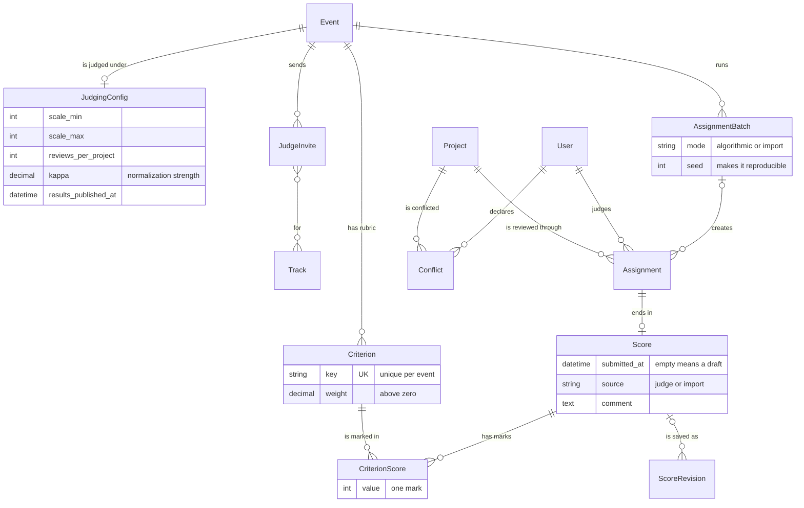

| Model | Key fields | Notes |
| --- | --- | --- |
| `JudgingConfig` | event (one-to-one), scale_min, scale_max, reviews_per_project, kappa, results_published_at, results_published_by, share_feedback | Created on first use. Check constraints keep the scale a real range, at least one review per project and kappa non-negative. |
| `Criterion` | event, key, label, description, weight, position | The rubric. Unique key per event; weight must be above zero. Every criterion shares the event's scale. |
| `JudgeInvite` | event, token (unique), email, tracks, all_tracks, expires_at, accepted_by, accepted_at, revoked_at | Single-use link. If `email` is set, only that account can accept. |
| `AssignmentBatch` | event, label, mode (`algorithmic`, `import`), scope, seed, target_reviews, shortfall_count, shortfall_detail | One run of the engine, or one import. The seed makes a run reproducible, and shortfalls (projects that couldn't get enough eligible judges) are recorded, never silently dropped. |
| `Assignment` | event, judge, project, batch (null for hand assignments), created_by, created_at | The gate for everything a judge may see. Unique on (judge, project). |
| `Conflict` | event, judge, project, reason, declared_by | The engine never assigns across one. Unique on (judge, project). |
| `Score` | assignment (one-to-one), event, judge, project, comment, submitted_at, source (`judge`, `import`), updated_at | Null `submitted_at` is a draft, which never counts. Unique on (judge, project): a resubmission updates the row. |
| `CriterionScore` | score, criterion, value | One mark per criterion per score. |
| `ScoreRevision` | event, judge, project, score, values_json, comment, submitted, source, actor, created_at | Append-only history: one row per save, never edited. |

## The community vote

**In short: each event can have one community vote, set up in `VotingConfig`; each voter has one ballot, and each line of a ballot gives some votes to one project.**

How a voter is identified depends on the access mode (an open link, a confirmed email address, or an account), so a ballot may or may not be linked to a user. The rules that make a count fair (the access mode, the method, the credit budget and the per-project ceiling) lock as soon as the first ballot is in. `EmailPass` rows are the one-time links sent to voters in an email-gated vote.

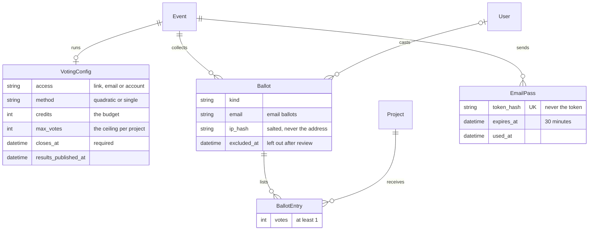

| Model | Key fields | Notes |
| --- | --- | --- |
| `VotingConfig` | event (one-to-one), is_enabled, access (`link`, `email`, `account`), method (`quadratic`, `single`), credits, max_votes, order (`shuffled`, `alphabetical`), opens_at, closes_at, link_token (unique), email_domains | Created when an organizer first opens the voting page. Empty `opens_at` means "when submissions close". `results_published_at` and `results_published_by` record the organizer's publication; results are public only when voting has closed and that is set. Access, method, credits, max_votes and order lock once a ballot exists. A voter's shuffled order isn't stored; it's recomputed from a seed. Check constraints keep credits and max_votes positive and the window in order. |
| `Ballot` | event, key (unique, names the ballot in the voter's session), kind, user, email, ip_hash, user_agent, created_at, updated_at | One per voter: partial unique constraints on (event, user) and (event, email). `ip_hash` is a salted SHA-256, never the raw address. `excluded_at`, `excluded_by` and `excluded_reason` record an organizer leaving it out of the count after review. |
| `BallotEntry` | ballot, project, votes | Unique on (ballot, project); votes at least 1 (a project with no votes has no row). Saving a ballot replaces its entries. |
| `EmailPass` | event, email, token_hash (unique), ip_hash, created_at, expires_at, used_at | A one-time link, valid 30 minutes. Only the hash of the token is stored, so a copy of the database can't be used to vote. |

## Certificates, the API, webhooks, embedding and rate limits

**In short: the tables behind the T4 features. Each is small, and most hang off an event or a user.**

* A `Record` is a signed certificate or judge's record, frozen when it's issued.
* An `ApiToken` lets a program act as its owner through the REST API.
* A `Webhook` points a URL at the activity log, and each `Delivery` is one attempt to send one log entry to it.
* `EmbedSettings` says whether, and where, the event's gallery may be embedded.
* `Throttle` rows count actions for rate limits that have no table of their own.

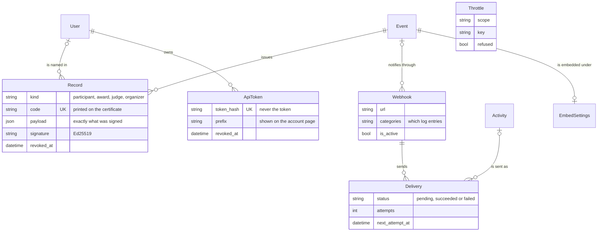

| Model | Key fields | Notes |
| --- | --- | --- |
| `Record` | event, user, kind (`participant`, `award`, `judge`, `organizer`), subject, code (unique), payload, signature, key_id, private, issued_at, issued_by, revoked_at, revoked_reason | A signed certificate or judge's record. `payload` is the exact JSON signed with Ed25519; `private` holds what a judge's record only commits to (their scores). One live record per person, kind and subject (`team:4`, `award:12`, `judge`), so issuing again adds nothing; a revoked one can be reissued. The code (16 characters in groups of four, 80 random bits) is printed on the certificate and is how anyone looks it up. |
| `ApiToken` | user, name, prefix, token_hash (unique), created_at, last_used_at, revoked_at | A personal access token. Only the SHA-256 of the token is stored; `prefix` identifies it on the account page. Revoked by the owner, by a password change, or unusable when the owner is deactivated. |
| `Webhook` | event (empty for platform webhooks), url, description, categories, secret, is_active, created_by, failure_streak, disabled_reason | `categories` are the audit log's own (`all`, `refused`, `submissions`, `judging`, ...). The secret signs deliveries. |
| `Delivery` | webhook, activity, uid (unique), kind, payload, status (`pending`, `succeeded`, `failed`), attempts, next_attempt_at, locked_until, last_status, last_error, last_duration_ms, response_excerpt, delivered_at | One send of one audit entry (or a test ping) to one webhook, with its retries. `locked_until` is how a sender claims it, so two workers never send the same one. |
| `EmbedSettings` | event (one-to-one), enabled, allowed_origins | Created when an organizer first saves the Embed tab; until then embedding is allowed anywhere. `allowed_origins` is one site per line (scheme and host only) and becomes the widget's `frame-ancestors`. |
| `Throttle` | scope, key, refused, created_at | One counted action for a rate limit with no table of its own (sign-ups per network, ballot and submission saves), or the marker that a key's refusal has been logged this window. Rows older than a day are swept. |

Import and export (`transfer`) has no tables of its own. Imports create ordinary rows in the other apps, matched to people by email; the file formats are described in ARCHITECTURE.md (Import and export) and in the README.txt inside every archive.

## How rows change over time

**In short: most rows follow a short life of their own. These diagrams show every state a row can be in, and what moves it from one to the next.**

### A project

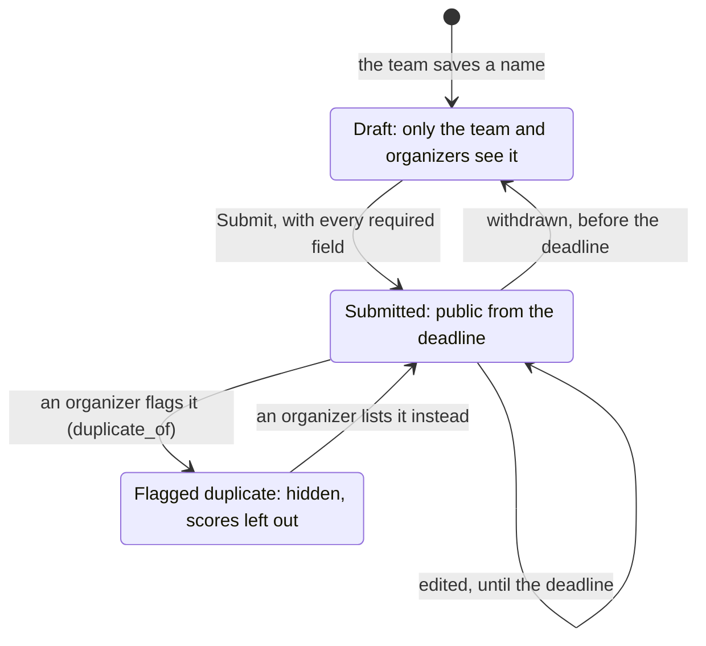

After the deadline nothing moves: a draft stays a draft (and is never listed), and a submitted project stays as it was handed in. Only an organizer's duplicate decision can still change what's listed.

### A review

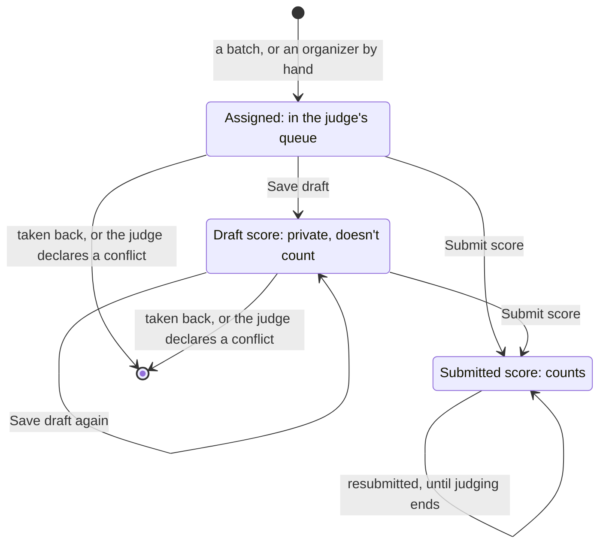

Every save, draft or submitted, appends a `ScoreRevision`, so the history is complete. A submitted score can't go back to being a draft, and it can't be taken away by a conflict: a judge who realises too late must tell an organizer, who decides.

### A community ballot

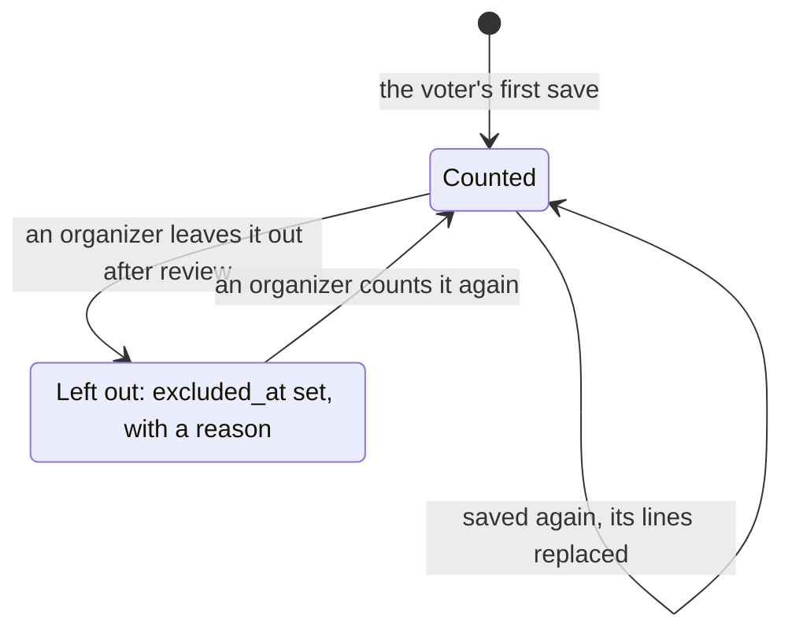

The voter isn't told when their ballot is left out, so a cheat learns nothing about what was caught. Changing a ballot is possible only while voting is open.

### A webhook delivery

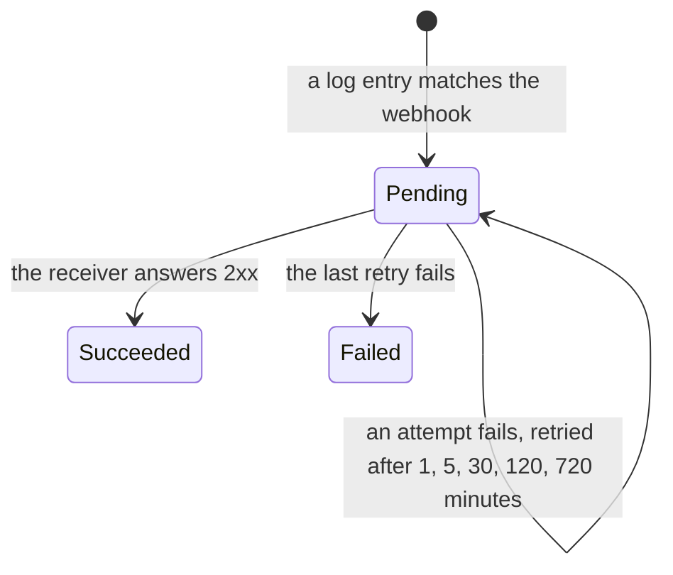

Re-sending a delivery by hand creates a new `Delivery` with a fresh id rather than reviving the old one. Five failed deliveries in a row switch the webhook off (`is_active` false, with `disabled_reason`).

### Links and records

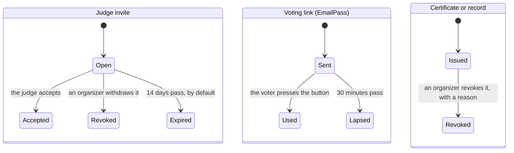

A revoked record stays in the table (and a check on the portal reports it revoked, with the reason); the same person, kind and subject can then be issued a new one.

## One project, followed through the tables

**In short: here is every row the fixture creates for one real project, NorthKiln's "Glass Signal", and how its place in the ranking is worked out from them without storing it.**

These are the rows on a fresh seed of `fixtures.json`, for the team that the demo account Priya captains.

**The people and the team.**

| Table | Rows |
| --- | --- |
| `User` | `priya1@example.org`, `member1_1@example.org`, `member1_2@example.org`, created from the team's member emails. Their display names come from the address ("Priya", "Member 1-1", "Member 1-2") |
| `Team` | NorthKiln, `external_id` `tm_01`, with its own invite code |
| `Membership` | three rows: Priya as captain (the first email listed in the fixture), the other two as members, each with the event copied onto it |

**The project.** One `Project` row: "Glass Signal", `external_id` `prj_01`, in the Security track, status `submitted`, `submitted_at` 27 February 2026, 04:08 UTC, tagline "One line of what it does." and repository `https://example.org/repo/01` (both straight from the fixture). It has no images, tags or form answers, because the fixture has none.

**The judging.** The fixture has three scores for it, so the seeder creates three `Assignment` rows in the "Imported from fixtures.json" batch, three `Score` rows (submitted, source `import`), nine `CriterionScore` rows (three marks each) and three `ScoreRevision` rows. The rubric is three equal-weight criteria on a 1 to 5 scale.

| Judge | Functionality | Quality | Innovation | Weighted mark | That judge's own average | Their spread (after shrinkage) | z-score |
| --- | --- | --- | --- | --- | --- | --- | --- |
| jdg_08 | 2 | 4 | 2 | 2.67 | 3.44, over 3 scores | 0.71 | -1.10 |
| jdg_03 | 4 | 5 | 4 | 4.33 | 3.83, over 2 scores | 0.66 | +0.76 |
| jdg_28 | 2 | 5 | 3 | 3.33 | 3.17, over 2 scores | 0.60 | +0.28 |

None of the last four columns is stored. On every request, `judging/results.compute_results` reads the marks, applies the current weights, compares each mark with that judge's own habits (JUDGING.md, section 4), and ranks:

* The raw average is 3.44, which puts Glass Signal 23rd of 40.
* Normalized, jdg_08's 2.67 is a clearly low mark for that judge, while the other two marks are a little above what those judges usually give. The mean z-score is -0.02, shown on the familiar scale as 3.54, which puts it 22nd: one place up.

**Everything else.**

* **Community vote:** no `BallotEntry` rows yet, because the seeded vote has no ballots.
* **Certificates:** in demo mode, three `Record` rows of kind `participant`, one per member, each with the subject `team:1`, a random code and an Ed25519 signature.
* **Activity log:** the fixture import writes no `Activity` rows. From here on every change would add one, for example `project.saved` when the team edits (in an open event) or `score.updated` when a judge changes a submitted score.

## Rules the database enforces on its own

**In short: the most important rules are also database constraints, so they would hold even if a view forgot to check them.**

* one team per person per event (`one_team_per_person_per_event`)
* one listed project per team (`one_listed_project_per_team`)
* one answer per question per project
* unique track names per event, unique invite codes, unique event slugs, unique emails
* deadline after kickoff (`event_deadline_after_kickoff`)
* a track that still has projects can't be deleted (`on_delete=RESTRICT`)
* one assignment, one score and one conflict row per judge and project
* a score can only exist for an assignment (one-to-one), so there's no way to hold a score for an unassigned project
* one mark per criterion per score; criterion weights above zero; a judging scale that is a real range
* one community ballot per account and per email address in an event, one line per project on a ballot, and at least one vote on every line

Rules that need the clock or a count (the deadline, team size, staff not competing) can't be written as constraints. They're enforced in the service layer, inside a transaction that holds SQLite's write lock, so two requests can't both pass a check that only one of them should (ARCHITECTURE.md, Deadline enforcement).

## How fixtures.json maps in

**In short: every record in the fixture becomes one or more ordinary rows, matched by its id, so loading it again adds nothing and never overwrites what was changed in the portal.**

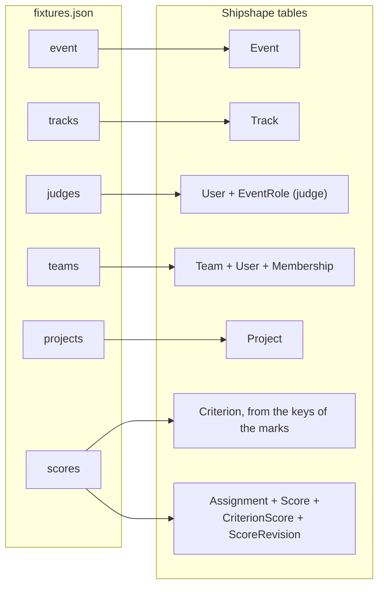

| Fixture | Becomes | Notes |
| --- | --- | --- |
| `event.id`, `name`, `submissions_close` | `Event.external_id`, `name`, `submissions_close_at` | `starts_at` isn't in the fixture, so it's set 72 hours before the deadline. Slug `sample-hack-2026`, time zone UTC, published, team limit 4 (the largest fixture team). |
| `tracks[]` | `Track` | Order kept as `position`. |
| `judges[]` | `User` + `EventRole(judge)` + judge tracks | `external_id` keeps `jdg_xx`. |
| `teams[]` | `Team` + `Membership` | The first email in `members` becomes captain. Member accounts are created from the emails; display names come from the address (`priya1@` becomes "Priya", `member7_2@` becomes "Member 7-2"). |
| `projects[]` | `Project` | `summary` goes to `tagline`, `repo_url` as is, status submitted, `submitted_at` kept. The description is empty because the fixture has none. |
| `scores[].criteria` keys | `Criterion` | functionality, quality and innovation, weight 1 each (the fixture gives no weights), scale 1 to 5, with a short description for judges. |
| `scores[]` | `Assignment` + `Score` + `CriterionScore` + `ScoreRevision` | Each score becomes a completed assignment in one "Imported from fixtures.json" batch, submitted, source `import`. Comments kept. Marks outside 1 to 5 would be skipped and reported; there are none. |

Seeding matches on these external ids and only creates missing rows, so it's safe to run on every boot and never overwrites edits made in the portal. The fixture has no votes; in demo mode the seed adds a `VotingConfig` to each event (the fixture event's open and email-gated, the demo event's opening at its deadline and needing an account) and no ballots.

## The awkward cases, and what we did

**In short: the fixture has a few deliberate traps. Each is loaded as it is, and handled by the portal's normal rules rather than cleaned up by hand.**

| Case in the fixture | Handling |
| --- | --- |
| `prj_41` repeats `prj_07`: same team (`tm_07`), title, summary and repo, handed in about thirteen and a half hours later | Imported with `duplicate_of = prj_07`. It's hidden from the gallery and from counts, visible to organizers under "Needs a decision", and an organizer can swap which of the two is listed. We kept the earlier one listed because the two are identical and it's the one the judges saw first. Both carry scores in the fixture; the last row says what happens to them. |
| Two teams called StillTrail (`tm_30`, `tm_40`) | Team names aren't unique. The organizer's team list shows ids. |
| Thirteen single-person teams | Allowed. The team limit is a maximum, not a minimum. |
| A submission after the deadline | None in this fixture. If there were, it would be imported as a draft (so never listed) and reported in the seed output. |
| `jdg_07` gave every project a 4 | Imported as is. Normalization turns those scores into neutral votes (z = 0) rather than letting them pull projects toward the middle; the results page labels the judge. |
| Two judges (`jdg_01`, `jdg_23`) scored exactly one project | Also neutral: one score can't be told apart from severity. |
| Two review batches were never finished, so projects have two to five reviews | Imported as they are. In demo mode the seed then runs one "top up to three reviews" batch (seed 2026): eight new reviews, all within the judges' tracks, left pending. Results show "informative" review counts and flag projects ranked on fewer than two. |
| Four judges scored the duplicate `prj_41`, three of whom also scored `prj_07` | Kept in the record and the exports, but left out of the rankings while `prj_41` is flagged, so no judge's view of one piece of work counts twice. Listing `prj_41` instead swaps which set counts. |
