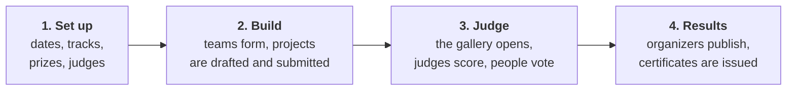

# Shipshape

Shipshape is a hackathon portal that runs on one laptop with the network off. People form teams through invite links and hand in projects they can edit until the deadline, which the server enforces. Everyone can browse the entries in a public gallery. Judges score the projects assigned to them against a weighted rubric, and the ranking corrects for harsh and generous judges. The community can vote too, in a way a group of friends can't hijack. When it's over, the organizers publish the results and issue certificates anyone can check.

It was built for the DOGFOOD 2026 hackathon. `docker compose up` brings it up on <http://localhost:8080>, seeded with the organizers' `fixtures.json`, with no internet, cloud account, API key or sign-up. The organizers' acceptance checker gives:

```
claimed T1 T2, verified T1 T2
```

## Contents

1. [What this submission claims](#what-this-submission-claims)
2. [How an event runs](#how-an-event-runs)
3. [Quick start](#quick-start)
4. [What's there after the first start](#whats-there-after-the-first-start)
5. [A guided tour](#a-guided-tour)
6. [Checking the tiers yourself](#checking-the-tiers-yourself)
7. [What it does, tier by tier](#what-it-does-tier-by-tier)
8. [Bonus challenges](#bonus-challenges)
9. [Who can do what](#who-can-do-what)
10. [Known limitations](#known-limitations)
11. [Configuration](#configuration)
12. [Running it without Docker](#running-it-without-docker)
13. [Tests](#tests)
14. [Troubleshooting](#troubleshooting)
15. [Questions](#questions)
16. [Glossary](#glossary)
17. [Repository layout and other documents](#repository-layout-and-other-documents)

## What this submission claims

| Claim | Claimed in | How to check it |
| --- | --- | --- |
| **T1: core** | `.dogfood.toml` and here | The checker verifies it: [acceptance-report.txt](acceptance-report.txt), or [run it yourself](#checking-the-tiers-yourself) |
| **T2: judging** | `.dogfood.toml` and here | The checker verifies it too |
| **T3: community** | Here | The [T3 table](#t3-community-claimed-in-this-readme), its tests, and the [tour](#a-guided-tour) |
| **T4: stretch** | Here | The [T4 table](#t4-stretch-claimed-in-this-readme), its tests, and the tour |
| **Bonus: threat model** | Here | [JUDGING.md, section 11](JUDGING.md#11-threat-model-voting-and-submission-abuse), `tests/test_threat_model.py`, `tests/attacks/probe.py` |
| **Bonus: API first** | Here | `/api/v1/openapi.json` (also `src/api/openapi.json`), `/api/v1/docs`, `tests/test_openapi.py` |

**Why T3 and T4 aren't in `.dogfood.toml`:** the checker can only test T1 and T2, and the brief says claiming more than it can confirm is what costs points. So `.dogfood.toml` claims exactly what the checker verifies, and T3, T4 and the bonus challenges are claimed here, each with its evidence. All 338 tests pass.

## How an event runs



1. An organizer creates the **event**, with its dates, **tracks** (categories) and prizes, and adds **judges**.
2. From kickoff, participants form **teams** and **submit** a project. They can edit it until the **deadline**, when everything locks.
3. Projects then appear in the public gallery. Judges score the ones **assigned** to them, and the community can vote.
4. Nothing is public until an organizer **publishes** it. Then every team sees its place, and certificates can be issued.

Words in bold are in the [Glossary](#glossary). The diagrams in these documents are drawn by GitHub and most Markdown viewers; in a plain text editor you'll see their readable source.

## Quick start

**You need** Docker with Compose v2 (Docker Desktop on Windows or macOS, or Docker Engine with the Compose plugin on Linux), port 8080 free, and about 700 MB of disk. The machine can be amd64 or arm64. **No internet is needed**, not even for the first build: the base system and every Python package are in the repository ([src/vendor/](src/vendor/README.md)).

1. **Start Docker**, and check it's running:

   ```bash
   docker compose version
   ```

2. **Get the code** (or unzip a download) and go into its folder:

   ```bash
   git clone <repository-url> shipshape
   cd shipshape
   ```

3. **Start the portal.** The first time, this builds the image (about half a minute), creates the database and loads the fixture:

   ```bash
   docker compose up
   ```

4. **Wait for** `Listening at: http://0.0.0.0:8080` in the log, then open <http://localhost:8080>. To sign in, choose **Sign in** and press one of the **Be ...** buttons; demo mode signs you in as that person. Every seeded account's password is `dogfood-demo`.

5. **Stop it** with `Ctrl+C`. Your data is kept, and the next `docker compose up` starts in seconds.

| To... | Run |
| --- | --- |
| Run it in the background | `docker compose up -d`, and `docker compose logs -f portal` to watch |
| Stop a background run | `docker compose down` (keeps the data) |
| Start again from a fresh copy of the fixture | `docker compose down -v`, then `docker compose up` |
| Use another port, such as 8090 | `PORTAL_PORT=8090 docker compose up` (PowerShell: `$env:PORTAL_PORT=8090; docker compose up`) |
| Rebuild after changing the code | `docker compose up --build` |
| Check it's healthy | `docker compose ps` says `healthy`; <http://localhost:8080/healthz> answers `ok` |

## What's there after the first start

**Two events:**

* **Sample Hack 2026**, loaded from `src/fixtures.json` as published: 8 tracks, 30 judges, 40 teams, 41 projects and 126 scores. Its deadline has passed, so it's closed to submissions and open for judging. Demo mode adds eight unstarted reviews, so the judging dashboard has something to chase, and an email-gated community vote open for two weeks.
* **Autumn Build Weekend**, a demo event that's open for three days from the first start, for trying teams, drafts and submitting. It runs on Asia/Kolkata time, to show that each event keeps its own time zone.

**Accounts**, each with a one-click button on the sign-in page:

| Button | Who | Try |
| --- | --- | --- |
| Be Rosa | Organizer of both events | The organizer console: judging, the vote, results, certificates, exports |
| Be Diego, Be Jonas | Fixture judges who have finished | A judge's queue, and being refused other judges' scores |
| Be Ada | A judge with reviews to do | Scoring, and declaring a conflict of interest |
| Be Priya | Captain of team NorthKiln | A closed submission, her team's place once results are out, a draft in the open event |
| Be Tom | A participant with no team | Joining a team from an invite link |
| Be Kit | Platform admin | Roles, deactivating accounts, the platform audit log |

Every judge and team member in the fixture has an account too, with the same password.

## A guided tour

**As an organizer (Be Rosa):** choose **Organize**, then **Sample Hack 2026**.

1. **Judging, Progress** shows who hasn't started. **Rubric** and **Assignments** show the criteria and who reviews what; a new batch is previewed before anything is saved.
2. **Judging, Results** shows the normalized ranking beside the raw one. Press **Publish the results** (this closes judging).
3. **Community vote**: press **Close voting now**, then **Publish the results**.
4. Open the event's public **Results** page to see what everyone else sees. Also try **Certificates**, **Integrity**, **CSV exports**, **Export and import** and **Activity**.

**As a judge (Be Ada, then Be Diego):** choose **Judging** in the top bar. Ada's queue lists only her projects: score one (**Save draft** or **Submit score**), or declare a conflict. As Diego, open <http://localhost:8080/api/judge/scores?judge=jdg_01>: another judge's scores answer 403, and a project outside your queue answers 404.

**As a participant (Be Priya, then Be Tom):** Priya's submission to Sample Hack 2026 is read-only now. In Autumn Build Weekend she can start a team, save a draft and submit it. Tom can join her team with the invite link from her team page.

**As a voter (signed out):** open the Sample Hack 2026 vote, give an email address, and open the link demo mode shows you. Spread up to 25 credits: n votes on one project cost n × n credits, with at most 3 on any one project.

**As a program:** the API reference is at <http://localhost:8080/api/v1/docs>. Make a token, then use it:

```bash
curl -X POST http://localhost:8080/api/v1/auth/tokens -H "Content-Type: application/json" \
     -d '{"name": "try", "email": "organizer@example.org", "password": "dogfood-demo"}'
curl -H "Authorization: Bearer <the token>" http://localhost:8080/api/v1/events/sample-hack-2026/judging/results
```

## Checking the tiers yourself

The organizers' checker, `tests/acceptance/run.py`, is included unmodified. It needs the portal running in demo mode (the default). Three ways to see the result:

1. **Read** [acceptance-report.txt](acceptance-report.txt), produced with the portal on a Docker network with no route to the internet.
2. **With Python 3.11 or newer** on your machine (on Windows, use `py` or `python`):

   ```bash
   python3 tests/acceptance/run.py .dogfood.toml --fixtures src/fixtures.json
   ```

3. **With Docker only**, using the portal's own image, which already has Python:

   ```bash
   docker run --rm --network "container:$(docker compose ps -q portal)" -v "$PWD:/w:ro" -w /w shipshape-portal:local python tests/acceptance/run.py .dogfood.toml --fixtures src/fixtures.json
   ```

   In PowerShell write `${PWD}`. In Git Bash on Windows, put `MSYS_NO_PATHCONV=1` in front and use `$(pwd -W)`.

Each ends with `claimed T1 T2, verified T1 T2`, after seven checks: the gallery is public, a fixture project is in it, the closed event refuses a late submission, a judge sees their own scores and is refused another's, a participant is refused judges' scores, and the CSV export works.

## What it does, tier by tier

### T1: core

| Requirement | What Shipshape does | Details |
| --- | --- | --- |
| Authentication and sessions | Server-side sessions; your account page lists every browser you're signed in on; five wrong passwords lock an address for 15 minutes | [ARCHITECTURE](ARCHITECTURE.md#sessions-and-sign-in) |
| A real role model | Visitors, members, participants, judges, organizers and admins, checked on every request, never just by hiding buttons | [Who can do what](#who-can-do-what), [ARCHITECTURE](ARCHITECTURE.md#where-permission-checks-live) |
| Events with dates, tracks and prizes | Kickoff, deadline, judging and results dates in the event's own time zone; tracks, prizes and custom form questions | Organize, New event |
| Teams by invite link | A secret link per team; one team per person per event, enforced by the database | [DATA-MODEL](DATA-MODEL.md#teams-and-projects) |
| Draft and edit until the deadline | Drafts are private to the team; teammates can edit until the deadline | Autumn Build Weekend |
| Deadline enforcement that holds | One module decides, by the server's clock, inside the same transaction as every write (forms, both APIs, images, rosters); refusals are logged | [ARCHITECTURE](ARCHITECTURE.md#deadline-enforcement), `tests/test_deadline.py` |
| Public gallery with search and filter | `/projects/`: search, filters by event, track and tag, several orders. Projects go public at the deadline, so nobody can copy an early idea | `tests/test_gallery_and_seed.py` |

### T2: judging

| Requirement | What Shipshape does | Details |
| --- | --- | --- |
| Judge invitation and assignment, by batch or algorithm | Add judges or send single-use invite links, each with their tracks. The engine gives every project 3 reviews from the least-loaded eligible judges, never across a track or a conflict; every batch is previewed and reproducible | [JUDGING 2](JUDGING.md#2-judges-and-who-reviews-what) |
| A weighted, organizer-configurable rubric | Criteria and weights per event; a paper-style scorecard; every save is kept | [JUDGING 3](JUDGING.md#3-weighted-rubric-scoring) |
| Role isolation, enforced in the backend | Another judge's scores: 403. A project outside your queue: 404, the same as one that doesn't exist. Tested with raw requests | [JUDGING 5](JUDGING.md#5-role-isolation-enforced-in-the-backend) |
| A live progress dashboard | Who hasn't started, who's part way, which projects are short of judges; refreshes every 10 seconds | [JUDGING 6](JUDGING.md#6-live-progress-dashboard) |
| Cross-judge normalization, documented and defended | Each judge's marks read against their own habits (shrinkage z-scores), tested on 1,000 simulated events and explained on the fixture | [JUDGING 4](JUDGING.md#4-cross-judge-normalization) |
| CSV export at every stage | 13 files, from teams to the audit log, organizers only, safe to open in a spreadsheet | [JUDGING 7](JUDGING.md#7-csv-export-at-every-stage) |
| Publishing the results | An organizer publishes, which closes judging; each team sees its place and, if shared, anonymous feedback | [ARCHITECTURE](ARCHITECTURE.md#publishing-results) |

### T3: community (claimed in this README)

The checker has no T3 checks, so T3 is claimed here, with where each part lives and how it's tested.

| Requirement | What Shipshape does | Details |
| --- | --- | --- |
| Community voting with configurable access | Open link, email-gated or signed in. Organizers and admins can't vote, and nobody can back their own team | [JUDGING 10.1](JUDGING.md#101-who-can-vote-three-access-modes), `tests/test_voting.py` |
| Better than one person, one vote | Quadratic voting with a ceiling: 25 credits, at most 3 votes a project. In simulation a 10% bloc reached the top three in no event, against 59% under one person, one vote | [JUDGING 10.2 to 10.4](JUDGING.md#102-the-method-quadratic-voting-with-a-ceiling) |
| Comments on gallery projects | A thread on every listed project, with safe Markdown and rate limits. Judges can't comment; organizers remove comments with a logged reason | `tests/test_comments.py` |
| Results hidden during the voting window | Nobody but organizers sees a number, not even turnout, until voting closes and an organizer publishes | [JUDGING 10.6](JUDGING.md#106-rules-the-server-enforces) |
| Randomised ballot order | Every voter gets their own stable shuffle, so position stops mattering: a fair 25% of top-three places from the first ten listed, against 94% with one shared order | [JUDGING 10.5](JUDGING.md#105-ballot-order-shuffled-for-each-voter) |
| Anti-abuse and an audit trail | Every rate limit in one table; flags for suspicious ballots, duplicate projects, repeated comments and outlier judges; an audit log readable in the console | [JUDGING 8](JUDGING.md#8-audit-trail-and-anti-abuse), `tests/test_integrity.py` |

### T4: stretch (claimed in this README)

The checker has no T4 checks either, so T4 is claimed here too.

| Requirement | What Shipshape does | Details |
| --- | --- | --- |
| A REST API and webhooks covering every UI action | 138 endpoints under `/api/v1/`, one for every page and form, with an OpenAPI 3.1 document. Webhooks are signed, retried and logged, with a built-in receiver that works offline | [ARCHITECTURE](ARCHITECTURE.md#the-rest-api), `tests/test_api_parity.py` |
| Certificate and record generation | Participation, winner and organizer certificates and judges' records, as printable pages and PDFs | [ARCHITECTURE](ARCHITECTURE.md#certificates-and-records), `tests/test_records.py` |
| Signed, publicly verifiable judge records | Ed25519 signatures anyone can check offline with `python src/records/verify.py`; a judge's record holds a hash of their scores, never the marks | the same |
| An embeddable gallery widget | Two lines of HTML on any site; public data only; organizers choose which sites may embed it | [ARCHITECTURE](ARCHITECTURE.md#the-embeddable-gallery), `tests/test_embeds.py` |
| Bulk import and export | The whole event as one .zip; imports are previewed and always make a new event; teams and judges from spreadsheets | [ARCHITECTURE](ARCHITECTURE.md#import-and-export), `tests/test_transfer.py` |

## Bonus challenges

Of the four optional challenges, two are claimed:

* **Threat model** (claimed): [JUDGING.md, section 11](JUDGING.md#11-threat-model-voting-and-submission-abuse) goes through 43 attacks on voting and submissions (sybil votes, ballot stuffing, scraping, judge collusion, deadline gaming): 28 stopped, 11 open, the rest capped, flagged or logged. Each has a test, including tests that pin the open gaps, and `tests/attacks/probe.py` attacks a running portal. Writing it found four holes and a leak, now fixed.
* **API first** (claimed): every UI action is in the documented API, with a published OpenAPI 3.1 document of 150 operations, generated from the same declarations that route the requests. During the tests every answer is checked against it, and the run fails if any endpoint goes untested. [ARCHITECTURE](ARCHITECTURE.md#the-rest-api) explains how.

The normalization proof is documented as part of T2 ([JUDGING 4](JUDGING.md#4-cross-judge-normalization)) but not claimed as a separate bonus. The pairwise judging mode wasn't attempted.

## Who can do what

| Can... | Visitor | Member | Participant | Judge | Organizer | Admin |
| --- | --- | --- | --- | --- | --- | --- |
| Browse events, the gallery and published results | yes | yes | yes | yes | yes | yes |
| Start or join a team | | yes | | no | no | no |
| Save, submit and edit the team's project | | | until the deadline | | | |
| Vote in the community vote | by access mode | yes | yes, not for their own project | yes | no | no |
| See drafts and flagged duplicates | | | own team's | | yes | yes |
| Score projects | | | | their own queue | | |
| See scores | | | own feedback, once shared | only their own | all | all |
| Run the event, judging and publishing | | | | | yes | yes |
| Create events | | | | | with the organizer role | yes |
| Change roles, deactivate accounts | | | | | | yes |

Organizers can't edit a team's project, and nobody can change a project after the deadline. An organizer can move the deadline (logged), but not later once judges have scored or anyone has voted.

## Known limitations

* **The checker can't verify T3 and T4**, so they're claimed here with their tests and walkthroughs instead.
* A patient cheat with several real devices, networks and inboxes gets past the anti-abuse checks, and so do colluding judges more often than not ([JUDGING 11.5](JUDGING.md#115-what-this-doesnt-stop)).
* Email is only used for email-gated voting, and only with an SMTP server set; offline, messages go to an outbox folder. Password resets aren't built, and judges are invited by link.
* One rubric per event, not per track, on purpose ([JUDGING 3](JUDGING.md#3-weighted-rubric-scoring)).
* SQLite, and images served by Django itself: right for a laptop-sized event, not tried at a big public one ([ARCHITECTURE](ARCHITECTURE.md#if-this-had-to-host-a-big-public-event)).
* Offline checking of a certificate can't know it was revoked; that needs the portal.

## Configuration

Settings are environment variables, set under `environment:` in `docker-compose.yml`. The ones you're most likely to change:

| Variable | Default | Meaning |
| --- | --- | --- |
| `DEMO_MODE` | on in compose | Demo accounts, the demo event and the checker's sessions. **Turn it off for a real event** |
| `DEMO_PASSWORD` | `dogfood-demo` | The password of every seeded account |
| `PORTAL_PORT` | 8080 | The port on your machine |
| `EMAIL_HOST` | not set | An SMTP server for voting emails; without it they're written to a folder |
| `RECORD_SIGNING_KEY` | generated | Pins the key that signs certificates |

[ARCHITECTURE.md, Configuration](ARCHITECTURE.md#configuration) lists every variable. For a real event, turn demo mode off, start from a clean database and create the first admin with `docker compose exec portal python manage.py createsuperuser`.

## Running it without Docker

For development, with Python 3.11 or 3.12 (this installs the packages from the internet). Keep the virtual environment and `DATA_DIR` outside synced folders such as OneDrive, which can lock SQLite files.

```bash
python3 -m venv .venv
.venv/bin/pip install -r src/requirements.txt
export DEMO_MODE=1 DEBUG=1 DATA_DIR=/tmp/shipshape-data
.venv/bin/python src/manage.py migrate
.venv/bin/python src/manage.py seed
.venv/bin/python src/manage.py runserver 8080
```

On Windows use `py -m venv .venv`, `.venv\Scripts\` instead of `.venv/bin/`, and `$env:DEMO_MODE=1` (and so on) instead of `export`. `seed` is safe to run again: it only adds what's missing.

## Tests

```bash
python src/manage.py test                         # all 338 tests
python src/manage.py test tests.test_judging      # one module
```

Without Python installed, run them in the portal's image (after `docker compose build`), offline:

```bash
docker run --rm -v "$PWD:/w:ro" -w /w -e DATA_DIR=/tmp/data shipshape-portal:local python src/manage.py test
```

The run ends by confirming that all 138 API endpoints were exercised, each answer checked against the OpenAPI document. The commands that regenerate the evidence in JUDGING.md are listed at its start.

## Troubleshooting

| Symptom | Fix |
| --- | --- |
| "Cannot connect to the Docker daemon" | Start Docker Desktop (Windows, macOS) or the Docker service (Linux: `sudo systemctl start docker`) |
| `docker-compose: command not found` | You have the old Compose v1. Use `docker compose`, with a space |
| "port is already allocated" | Use another port: `PORTAL_PORT=8090 docker compose up`. For the checker, free 8080 or use its Docker way, which doesn't use the port |
| The build says a file in `vendor/` is not found | The copy of the repository is incomplete. Clone or download it again, and compare with the checksums in [src/vendor/README.md](src/vendor/README.md). Only amd64 and arm64 processors are supported |
| The page doesn't load right after starting | The first start migrates and seeds first. Wait for `Listening at` in the log |
| The checker fails the judge or participant checks | Demo mode is off, so its session cookies don't exist. Set `DEMO_MODE` to `1` |
| Code changes don't show | Rebuild: `docker compose up --build` |
| In Git Bash, `docker run -v` mounts the wrong folder | Put `MSYS_NO_PATHCONV=1` in front and use `$(pwd -W)` |
| "Too many wrong passwords" | Five wrong passwords lock an address for 15 minutes. Wait, or use a **Be ...** button |

## Questions

**Is the internet ever needed?** No. The build installs everything from `src/vendor/`, builds with networking switched off, and never pulls an image; this was tested on a Docker with no network and no images. The running portal loads nothing from outside itself.

**Where is my data?** In the Docker volume `portal-data`: the database, uploads and keys. `docker compose down` keeps it, `docker compose down -v` deletes it, and `docker compose cp portal:/data ./backup` copies it out. To take one event elsewhere, use the console's **Export and import**.

**Can I load a different fixtures.json?** Replace `src/fixtures.json`, then `docker compose down -v` and `docker compose up --build`. An organizer can also import one from Organize, **Import one**.

**Why is the fixture event closed?** Its deadline, 1 March 2026, has passed, so the server refuses changes, as the checker expects. Use **Autumn Build Weekend** to try submitting.

**Where do emails go?** Without `EMAIL_HOST`, into files in `DATA_DIR/outbox`; demo mode also shows the voting link on screen.

**What were the fixture's awkward cases?** A duplicate project, two teams with the same name, single-person teams, a judge who gave everyone a 4, and unfinished review batches. [DATA-MODEL.md](DATA-MODEL.md#the-awkward-cases-and-what-we-did) says how each is handled.

## Glossary

| Word | Means |
| --- | --- |
| **Event** | One hackathon, with its own dates, tracks, prizes, teams and judges |
| **Kickoff** and **deadline** | When projects can start, and when submissions close. From the deadline instant, teams can't change their project or their roster |
| **Track** | A category of projects, such as "Climate". Judges review only their own tracks |
| **Team** and **invite link** | The people on one project, and the secret link they share to let others join |
| **Draft** and **submitted** | A saved project only its team and the organizers can see, and a handed-in one, public from the deadline |
| **Organizer console** | Where organizers run an event: Organize, then the event |
| **Judge** and **floater** | Someone who scores the projects assigned to them; a floater may review any track |
| **Assignment** and **batch** | "This judge reviews this project", and one previewed, reproducible run of the assignment engine |
| **Rubric** | The criteria projects are marked on, each with a weight |
| **Normalization** | Reading each judge's marks against that judge's own habits, so harsh and generous judges count fairly |
| **Community vote** | A vote beside the judges', by open link, by email or signed in |
| **Quadratic voting** | n votes on one project cost n × n credits from a fixed budget, so piling onto one project is expensive |
| **Publish** | An organizer's decision to make results public; for the judges' results it also closes judging |
| **Certificate** and **judge's record** | Signed statements that someone took part, won or judged, checkable offline |
| **Activity log** | The audit trail: every change, refusal and decision, with who and when |
| **Fixture** | `src/fixtures.json`, the sample data every DOGFOOD portal loads |
| **Demo mode** | Demo accounts, one-click sign-in, a second event and the checker's session cookies |
| **Tier** | The brief's levels: T1 core, T2 judging, T3 community, T4 stretch |

JUDGING.md has its own list of judging and voting terms.

## Repository layout and other documents

```
.dogfood.toml            the checker's settings: address, claimed tiers, session cookies, routes
acceptance-report.txt    the checker's output against this build
docker-compose.yml       the one-command start
README.md                this file
ARCHITECTURE.md          how it's built and why, with diagrams
DATA-MODEL.md            every table, how rows change, and how the fixture maps in
JUDGING.md               assignment, scoring, normalization, isolation, the vote, the threat model
LICENSE                  MIT
src/                     the application, and the Docker build context
  Dockerfile, boot.py      the image, and its start-up (migrate, seed, serve)
  vendor/                  the base system and Python packages, so the build is offline
  fixtures.json            the organizers' fixture data, unmodified
  portal/ accounts/ events/ teams/ projects/ judging/ voting/ integrity/
  records/ embeds/ transfer/ webhooks/ api/
                           one Django app per area
  templates/, static/      the pages, one stylesheet, three small scripts
tests/                   338 tests
  acceptance/              the organizers' checker and brief, unmodified
  attacks/probe.py         the threat model's HTTP attack script
```

* [ARCHITECTURE.md](ARCHITECTURE.md): the container and its offline build, the code layout, how a request is handled, permissions, deadlines, the API, webhooks, certificates, the embed, import and export, configuration and storage.
* [DATA-MODEL.md](DATA-MODEL.md): every table with a diagram per area, how rows change over time, one project followed through the tables, and the fixture mapping.
* [JUDGING.md](JUDGING.md): assignment, the rubric, normalization and its proof, isolation, the community vote and its evidence, and the threat model.
* [src/vendor/README.md](src/vendor/README.md): the vendored files, with sources, checksums and licenses.

MIT licensed, see [LICENSE](LICENSE).
